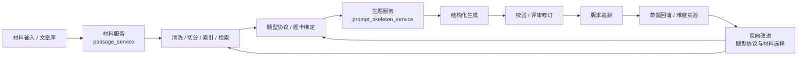

# 面向公考阅读理解题目的生产与质量迭代平台

基于材料服务与生题服务，构建从材料供给、题型协议、结构化生成到评审修订、版本追踪与蒸馏回流的闭环链路，让阅读理解题目生产从一次性生成走向可追踪、可复用、可持续优化。

这是一个本地可运行原型和能力验证项目，聚焦教育 AI 生产链路实验。项目重点不在单次 Prompt 出题，而在于把材料、协议、生成、评审、版本、蒸馏和实验组织成可复盘的工程流程。

项目状态：本地可运行原型｜双服务架构｜材料 V2 检索｜题卡驱动生成｜评审与蒸馏回流实验

## 核心能力

### 1. 材料供给

为题目生成提供可追踪、可治理的材料来源，减少临时找文、临时贴文带来的不稳定。

- 支持文章接入、清洗、切分与材料片段沉淀。
- 围绕题型需求组织候选材料检索与材料适配。
- 保留材料来源、处理状态和使用反馈，方便后续复查与迭代。

### 2. 题型协议

把阅读理解题型经验沉淀为可复用的生成协议，让系统按题型逻辑生产，而不是只依赖模型自由发挥。

- 覆盖中心理解、语句填空、语句排序等典型题型方向。
- 将题型要求拆解为题卡、槽位、约束和校验规则。
- 支持不同题型在材料结构、答案逻辑和解析要求上的差异化控制。

### 3. 结构化生成

在材料、题型协议和生成模板共同约束下输出题目结构，提升结果可校验、可评审、可交付的程度。

- 生成题干、选项、答案、解析等结构化内容。
- 将材料来源、题型配置和生成过程一并纳入结果记录。
- 通过解析与校验机制降低格式漂移和内容失控风险。

### 4. 评审版本链

让题目从生成结果进入可追踪的修改与确认流程，支持面向生产场景的质量管理。

- 支持题目确认、修改、作废等评审动作。
- 记录题目版本变化，保留修改前后的证据链。
- 将人工判断与系统生成结果连接起来，便于复盘问题来源。

### 5. 蒸馏回流

把真题样本、评审记录和错误案例转化为后续改进依据，让失败经验回流到系统资产中。

- 基于样本与运行结果分析题型协议和生成规则的缺口。
- 将评审结论沉淀为可讨论、可验证的修正方向。
- 支持从单次问题修补走向题卡、材料选择和提示策略的持续迭代。

### 6. 难度实验

尝试把题目难度从主观判断拆解为可观察信号，为后续质量分析和题型控制提供实验依据。

- 围绕题型、材料和生成约束观察难度变化。
- 支持阶段性实验记录与对照分析。
- 为难度校准、质量评估和后续策略优化提供可复查样本。

## 系统链路



这条链路体现了项目的核心目标：题目不是模型一次性吐出的文本，而是从材料来源、题型约束、生成结构、人工评审到经验回流逐步沉淀的生产过程。

## 与普通 Prompt 出题工具的区别

| 对比维度 | 普通 Prompt 出题工具 | 本项目的处理方式 |
| --- | --- | --- |
| 生成方式 | 一次性 Prompt 生成，结果主要依赖单轮模型输出 | 材料、协议、生成、评审、版本和回流共同组成闭环 |
| 材料来源 | 临时贴文或手动输入，来源和质量难以追踪 | 通过材料服务进行文章接入、治理、索引和候选检索 |
| 题型控制 | 依赖模型临场理解题型要求 | 将题型经验沉淀为题卡、槽位、约束和校验协议 |
| 修改过程 | 依赖人工重写，修改前后难以复盘 | 通过评审动作、版本记录和证据链追踪题目变化 |
| 经验沉淀 | 单次生成经验难以复用 | 通过真题蒸馏、错误案例和难度实验反向改进系统资产 |

## 项目定位

本仓库服务于公考/事业单位言语理解题目的材料池、题型骨架、真题蒸馏、难度实验和本地演示工作台。当前主线是围绕材料库和题目生成闭环推进本地原型验证。

核心服务有两个：

- `passage_service`: 材料摄取、切分、标签、影子材料池、材料搜索和材料治理。
- `prompt_skeleton_service`: 题型配置、prompt 组装、题目生成、真题蒸馏、难度控制和演示页面。

## 目录速览

```text
.
├── passage_service/                 # 材料服务，独立虚拟环境 passage_service/.venv
├── prompt_skeleton_service/          # 生题/演示服务，使用仓库根 .venv
├── desktop_bundle_20260420/          # 本地演示与样例材料包
├── configs/difficulty_experiments/   # 难度实验配置
├── docs/                             # 架构、交接、实验和启动文档
├── scripts/                          # 一键启动、实验、审计和报告脚本
└── test/                             # 材料卡/真题点位测试资产
```

## Quick Start

首次安装会创建根目录 `.venv` 和 `passage_service\.venv`，并以 editable 模式安装两个服务：

```powershell
powershell -ExecutionPolicy Bypass -File .\scripts\bootstrap-demo.ps1
```

开发环境一键拉起材料服务和生题服务：

```powershell
powershell -ExecutionPolicy Bypass -File .\scripts\start-demo.ps1 -Profile dev -Reload
```

开发端口：

- Prompt/demo UI: `http://127.0.0.1:8111/demo`
- 真题蒸馏 UI: `http://127.0.0.1:8111/demo/distill`
- 用户材料 UI: `http://127.0.0.1:8111/demo/user-material`
- Prompt diagnostics: `http://127.0.0.1:8111/api/v1/diagnostics/dependencies`
- Passage docs: `http://127.0.0.1:8101/docs`
- Passage diagnostics: `http://127.0.0.1:8101/api/v1/diagnostics/runtime`

如果要重建虚拟环境：

```powershell
powershell -ExecutionPolicy Bypass -File .\scripts\bootstrap-demo.ps1 -ForceRecreate
```

如果要同时起 ngrok 做临时外网演示：

```powershell
powershell -ExecutionPolicy Bypass -File .\scripts\start-demo.ps1 -Profile dev -Reload -StartNgrok
```

如果遇到 ngrok `ERR_NGROK_6030`，通常是同一个固定域名已有其他隧道占用。先关掉旧 ngrok 进程，或换一个临时域名重新拉起。

## 环境依赖

基础要求：

- Python 3.11+
- PowerShell 5+ 或 PowerShell 7+
- Git
- 可选：ngrok，用于外网临时访问本地 demo

Python 依赖以两个服务的 `pyproject.toml` 为准：

- `prompt_skeleton_service/pyproject.toml`: FastAPI、Uvicorn、Pydantic v2、PyYAML、httpx。
- `passage_service/pyproject.toml`: FastAPI、Uvicorn、SQLAlchemy、Pydantic v2、pydantic-settings、PyYAML、httpx、BeautifulSoup4、APScheduler。

## 环境变量

本机真实环境文件不要提交。仓库会忽略 `.env.demo`、`.env.dev`、`.env.mvp`、`passage_service/.env` 等文件，只保留示例文件。

推荐从示例创建本机配置：

```powershell
Copy-Item .\.env.demo.example .\.env.demo
Copy-Item .\passage_service\.env.example .\passage_service\.env
```

最少需要配置：

```powershell
$env:GENERATION_LLM_API_KEY="your_key"
$env:MATERIAL_LLM_API_KEY="your_key"
```

常用可选项：

```powershell
$env:GENERATION_LLM_BASE_URL="https://api.openai.com/v1"
$env:MATERIAL_LLM_BASE_URL="https://api.openai.com/v1"
$env:PASSAGE_OPENAI_API_KEY="your_key"
$env:PASSAGE_OPENAI_BASE_URL="https://api.openai.com/v1"
```

如果要开启 demo API token：

```powershell
$env:PROMPT_SERVICE_SECURITY_ENABLED="true"
$env:PROMPT_SERVICE_API_TOKEN="replace_with_local_token"
```

## 常用工作流

材料影子库：

```powershell
.\.venv\Scripts\python.exe .\scripts\run_shadow_material_pilot.py
```

真题蒸馏调试：

```powershell
.\.venv\Scripts\python.exe .\scripts\build_distillation_debug_packet.py
```

难度实验工作台：

```powershell
.\.venv\Scripts\python.exe .\scripts\difficulty_experiment_workbench.py --help
```

前端 smoke：

```powershell
.\.venv\Scripts\python.exe .\scripts\smoke_test_demo_frontend.py
```

## 测试

Prompt 服务测试：

```powershell
.\.venv\Scripts\python.exe -m pytest .\prompt_skeleton_service\tests
```

Passage 服务测试：

```powershell
.\passage_service\.venv\Scripts\python.exe -m pytest .\passage_service\tests
```

快速语法检查示例：

```powershell
.\.venv\Scripts\python.exe -m py_compile .\scripts\run_shadow_material_pilot.py
```

## 开发维护说明

当前保留的影子库配置是：

```text
passage_service/app/config/shadow_material_pilot_round2.yaml
```

旧版 `shadow_material_pilot*.yaml`、根目录 `tmp_*`、`load_test_*.json` 和临时抽取目录已经清掉，并写入 `.gitignore`，后续不要再把这类运行产物提交上来。

## 提交卫生

可以提交：

- 源码、配置模板、prompt 资产、架构/交接文档。
- `desktop_bundle_20260420/` 里的本地演示与样例材料包。
- `configs/difficulty_experiments/`、`docs/`、`scripts/` 里服务主线需要的实验和报告资产。

不要提交：

- `.env*` 真实环境文件、API key、ngrok token。
- `logs/`、`reports/`、`tmp/`、`tmp_*`、`load_test_*.json`。
- 本机数据库、虚拟环境、缓存、导出文件、学习机临时目录。

换机器继续开发的标准路径：

```powershell
git clone https://github.com/Maru979182063/-question-factory.git agent
cd agent
git checkout codex/dev-local
powershell -ExecutionPolicy Bypass -File .\scripts\bootstrap-demo.ps1
powershell -ExecutionPolicy Bypass -File .\scripts\start-demo.ps1 -Profile dev -Reload
```
