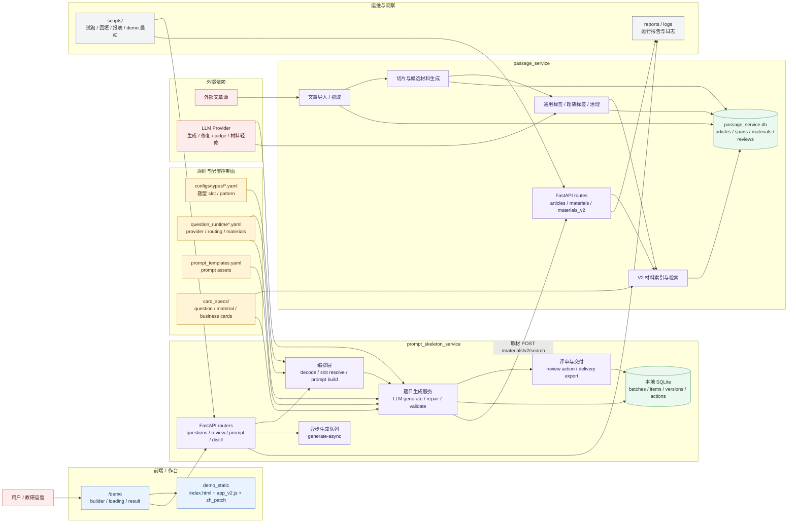
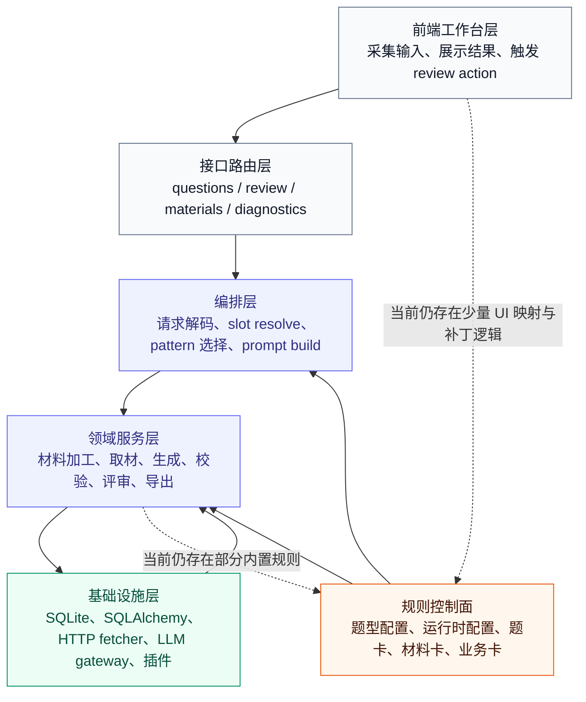
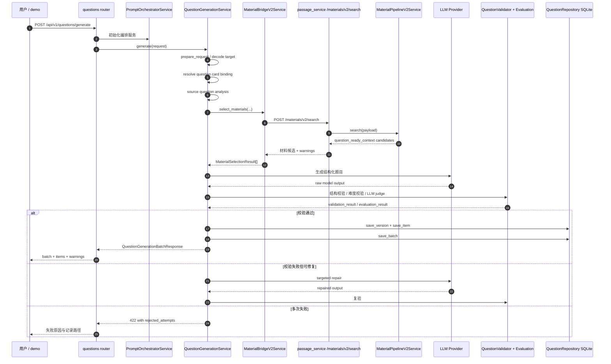
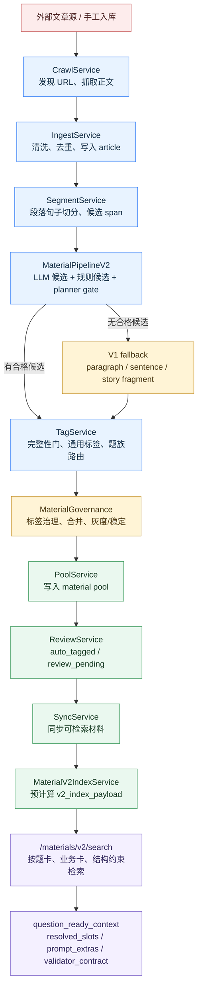
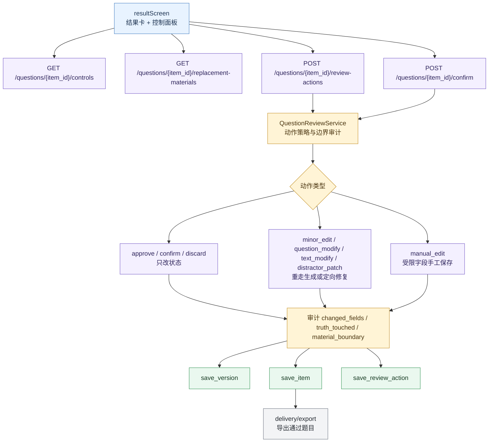
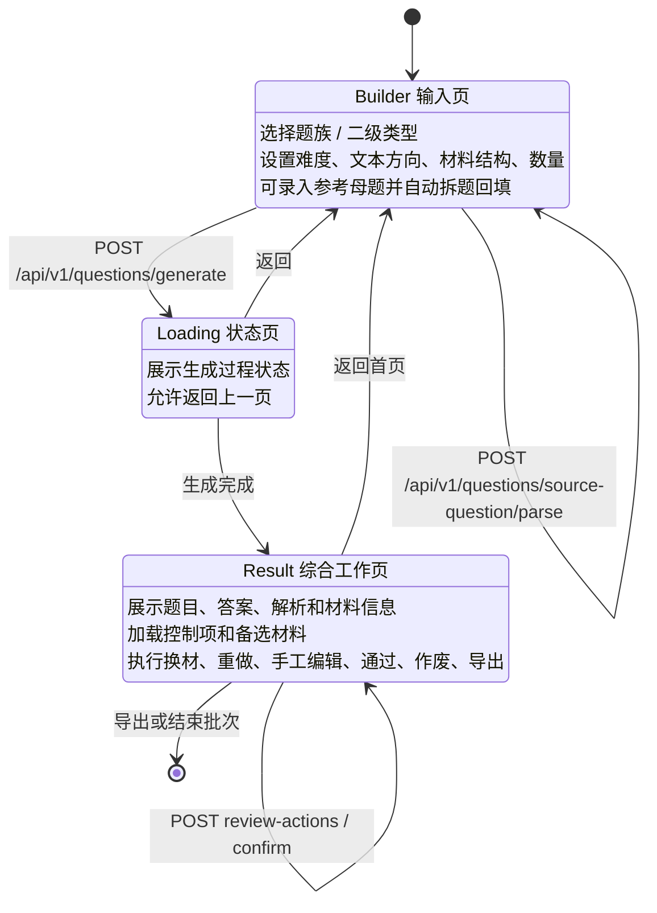
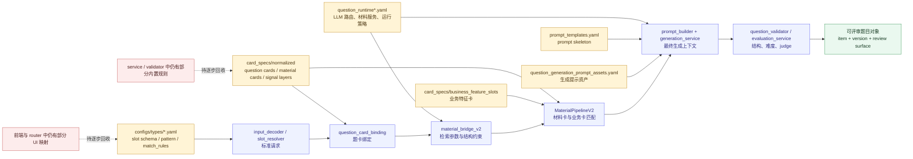

# 项目架构与服务流程图

本文档是 `docs/system_architecture.md` 的视觉版补充，用来快速理解当前真实系统，而不是描述未来理想架构。

阅读口径：

- `prompt_skeleton_service` 是出题、评审、交付侧主服务。
- `passage_service` 是文章、材料、题卡上下文侧主服务。
- `card_specs/` 与 `configs/` 是规则控制面，但当前仍有部分规则散落在 service、validator 和前端补丁里。
- `/demo` 是一个单页工作台，不是多页面后台。

## 1. 系统总览

## 2. 分层职责图

## 3. 出题生成主流程

## 4. 材料服务入库与 V2 检索流程

## 5. 评审与改题动作流程

## 6. 前端工作台页面流转

## 7. 规则控制面如何影响运行时

## 8. 文档维护建议

当下面任一事实发生变化时，应同步更新本文：

- `/demo` 的正式入口脚本或页面 screen 发生变化。
- `prompt_skeleton_service` 与 `passage_service` 的接口边界发生变化。
- `/materials/v2/search` 返回的 `question_ready_context` 字段发生变化。
- 题卡、材料卡、业务卡成为唯一规则来源，或新增新的规则控制面。
- review action 新增动作类型，或动作边界从 `QuestionReviewService` 中迁移。
