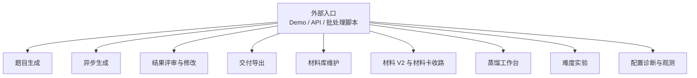
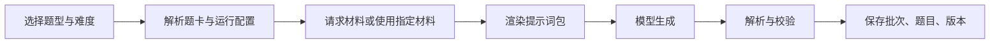
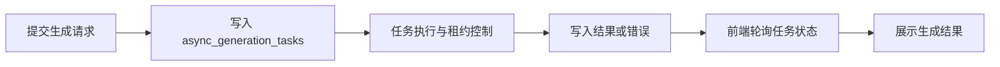
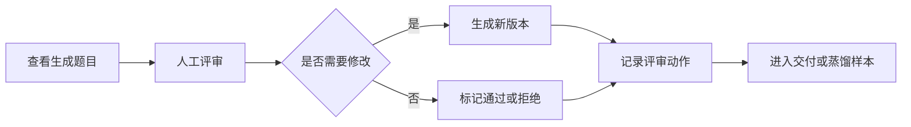
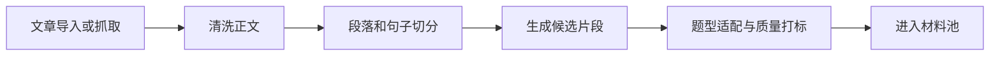
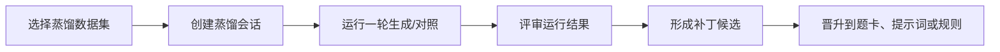

# 核心功能清单（core_feature_catalog）

这份清单按“对外能讲清楚的功能”组织，不按代码目录机械罗列。每个功能都给出负责服务、主要输入、主要输出和项目价值，适合放在交接材料或简历项目说明里。

## 功能总览

## 1. 题目生成

- **负责服务**：生题服务（prompt_skeleton_service）
- **主要入口**：Demo 工作台、生成 API、批量测试脚本
- **主要输入**：题型母族、子族/叶族、目标难度、材料来源、生成数量、运行配置
- **主要输出**：生成批次、题目条目、题目版本、结构化题干/选项/答案/解析、校验结果
- **项目价值**：把题目生成从“临时写 prompt”变成“题卡协议 + 材料适配 + 结构化校验”的稳定流程。

典型流程：

## 2. 异步生成

- **负责服务**：生题服务（prompt_skeleton_service）
- **主要入口**：异步任务 API、Demo 工作台的异步状态轮询
- **主要输入**：生成请求、客户端标识、请求追踪 ID
- **主要输出**：异步任务状态、生成结果、错误信息、运行事件
- **项目价值**：支持长耗时生成任务，不让前端或调用方阻塞在单次请求上。

典型流程：

## 3. 结果评审与修改

- **负责服务**：生题服务（prompt_skeleton_service）
- **主要入口**：Review 工作台、题目版本 API
- **主要输入**：题目 ID、当前版本、人工评审动作、修改内容、使用反馈
- **主要输出**：新版本、评审动作、当前状态、使用事件
- **项目价值**：让题目生产具备版本链和人工修补能力，方便回看“为什么这道题变成现在这样”。

典型流程：

## 4. 交付导出

- **负责服务**：生题服务（prompt_skeleton_service）
- **主要入口**：交付服务、脚本或工作台操作
- **主要输入**：题目集合、版本状态、交付格式要求
- **主要输出**：可交付题目包、筛选后的题目列表、导出记录
- **项目价值**：把内部生成结果转换成对外可消费的题目资产。

## 5. 材料库维护

- **负责服务**：材料服务（passage_service）
- **主要入口**：文章导入/抓取、材料处理 API、后台任务
- **主要输入**：文章来源、URL、原文、领域、语言、处理参数
- **主要输出**：文章、段落、句子、候选片段、材料片段
- **项目价值**：将“找材料”从临时手工动作变成可索引、可复查、可反馈的材料资产生产线。

典型流程：

## 6. 材料 V2 与材料卡收路

- **负责服务**：材料服务（passage_service）
- **主要入口**：V2 material search、预计算任务、材料卡注册表
- **主要输入**：题型家族、子类、难度、材料特征、质量反馈
- **主要输出**：材料卡匹配结果、业务家族索引、适配分数、决策轨迹
- **项目价值**：把材料是否适合某个题型这件事显式化，支持材料与题卡之间的异步收路和持续修正。

## 7. 蒸馏工作台

- **负责服务**：生题服务（prompt_skeleton_service）
- **主要入口**：蒸馏工作台、distill API
- **主要输入**：样本集、蒸馏会话、运行参数、评审结论、补丁目标
- **主要输出**：蒸馏运行、运行评审、补丁候选、晋升记录
- **项目价值**：把失败样例和人工经验沉淀为可晋升的工程资产，而不是停留在临时反馈。

典型流程：

## 8. 难度实验

- **负责服务**：生题服务（prompt_skeleton_service）为主，材料服务提供材料侧信号
- **主要入口**：难度实验脚本、难度工作台、评估/校准服务
- **主要输入**：目标难度、题型叶族、材料样本、对照变量
- **主要输出**：难度评估结果、校准差异、失败案例、修补建议
- **项目价值**：证明系统不是只会“声明难度”，而是能通过实验验证难度控制是否有效。

## 9. 配置诊断与观测

- **负责服务**：两个服务都有，生题服务更集中
- **主要入口**：readyz、diagnostics、metrics、运行事件表
- **主要输入**：环境变量、配置文件、服务状态、请求追踪 ID
- **主要输出**：健康状态、配置诊断、运行事件、限流命中、错误信息
- **项目价值**：方便本地演示、线上排障和交接时快速定位问题。

## 面试讲法

可以把项目能力压缩成三句话：

1. 我把阅读理解生题拆成“材料供给、题卡协议、模型生成、结构化校验、人工评审、蒸馏回流、难度实验”的闭环。
2. 工程上用两个 FastAPI 服务分离材料域和生题域，用 SQLite/配置资产保留版本、评审、任务和实验证据。
3. 业务上用“母族 -> 子族 -> 叶族”表达题型消费路径，材料卡和信号层服务于这条路径，而不是反过来让表结构决定业务语言。
