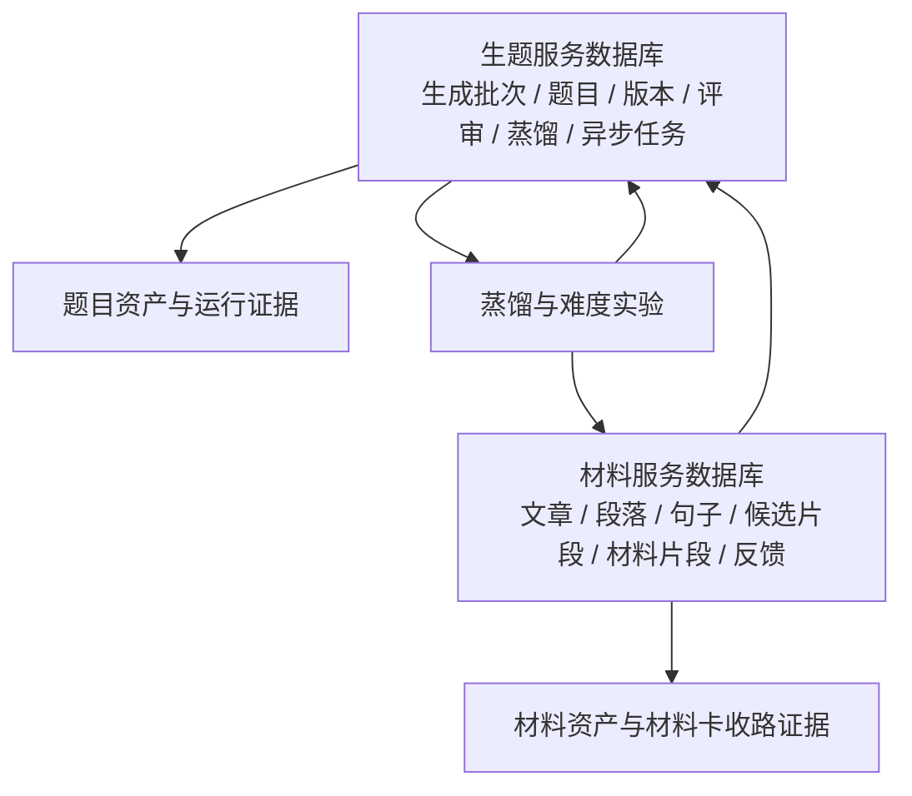
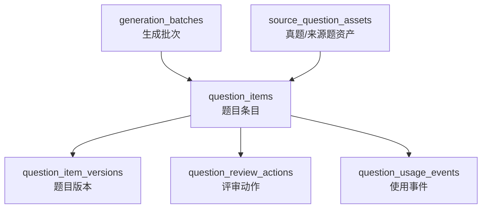
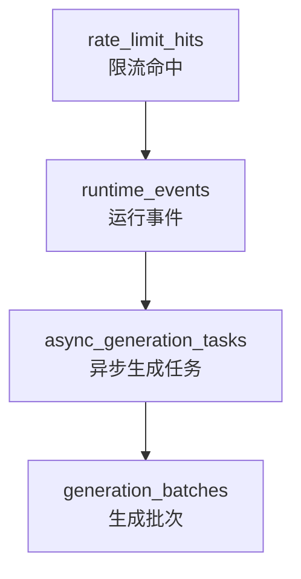
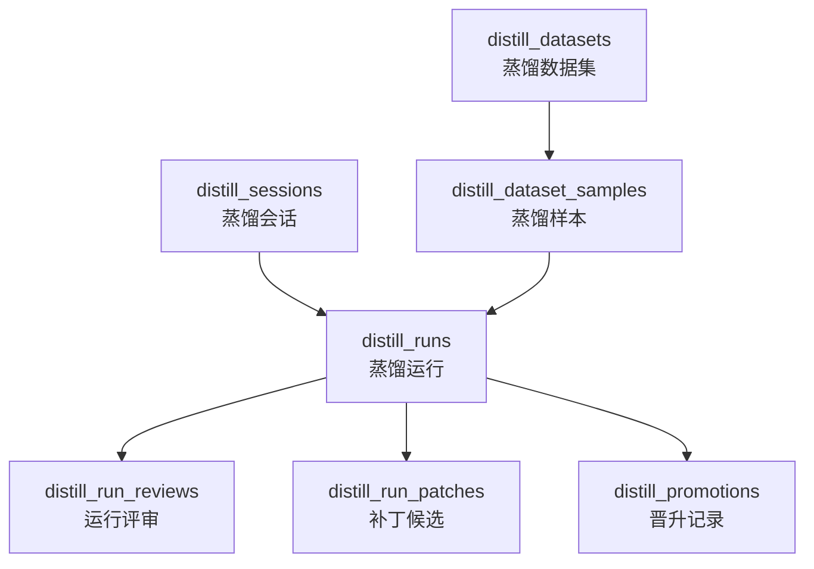
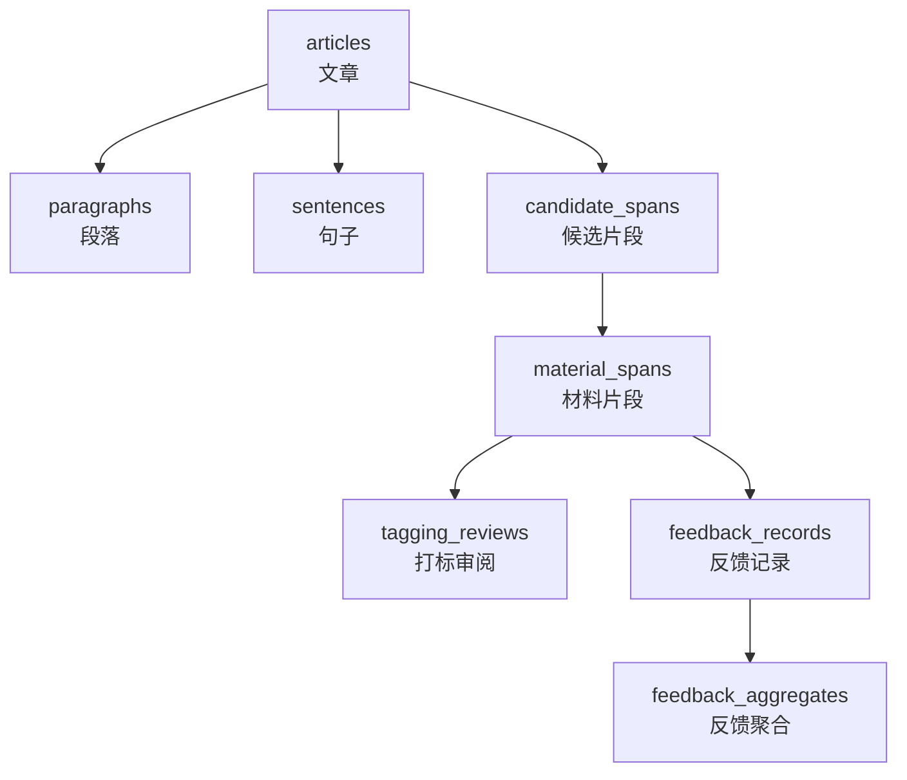
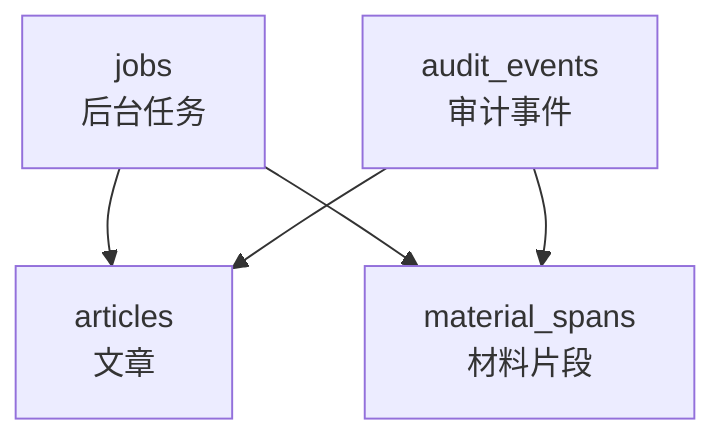
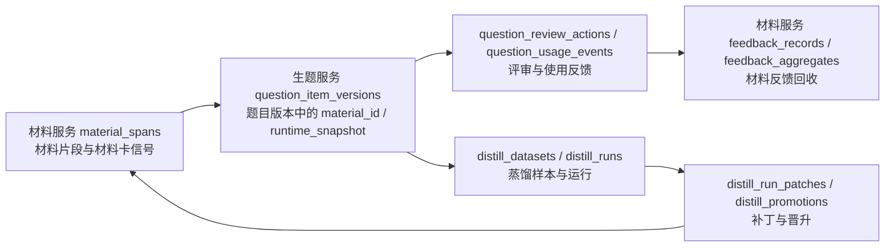

# 数据与表结构图（data_schema_overview）

这份文档按服务拆解数据库结构。项目中有两类核心数据：生题服务保存生成、评审、异步任务、蒸馏和运行事件；材料服务保存文章、段落、句子、材料片段、反馈和审计。

## 数据域总览

## 生题服务表结构

### 生成与评审主链路

| 表名 | 中文含义 | 主要用途 |
| --- | --- | --- |
| `generation_batches` | 生成批次 | 保存一次生成请求的批次级 payload、创建和更新时间 |
| `question_items` | 题目条目 | 保存题目 ID、题型、业务子类、状态、当前版本和最新动作 |
| `question_item_versions` | 题目版本 | 保存每个版本的题干、选项、答案、解析、提示词快照、模型原始输出、解析和校验结果 |
| `question_review_actions` | 评审动作 | 保存接受、拒绝、修改、重生成等人工或系统评审动作 |
| `question_usage_events` | 使用事件 | 保存题目被交付、采用、反馈等后续使用记录 |
| `source_question_assets` | 来源题资产 | 保存真题或来源题的结构化信息，用于蒸馏、对照和题卡校准 |

### 题目版本字段重点

`question_item_versions` 是生题证据链最重的表，关键字段包括：

- `stem`、`options_json`、`answer`、`analysis`：题目结构化内容。
- `prompt_package_json`、`prompt_render_snapshot_json`：提示词包和渲染快照。
- `raw_model_output_json`、`parsed_structured_output_json`：模型原始输出和解析结果。
- `parse_error`、`validation_result_json`、`evaluation_result_json`：解析、校验和评估证据。
- `runtime_snapshot_json`：运行时上下文快照。

## 生题服务异步与观测表

| 表名 | 中文含义 | 主要用途 |
| --- | --- | --- |
| `async_generation_tasks` | 异步生成任务 | 保存异步请求、任务状态、租约、重试次数、结果和错误 |
| `runtime_events` | 运行事件 | 保存请求、任务、路径、客户端、严重程度和事件详情 |
| `rate_limit_hits` | 限流命中 | 保存限流 key、观察时间和窗口信息 |

异步任务关键字段：

- `task_type`、`status`：任务类型和状态。
- `request_json`、`result_json`、`error_json`：请求、结果和错误。
- `lease_owner`、`lease_expires_at`、`attempt_count`：任务租约和重试控制。
- `batch_id`：任务完成后关联到生成批次。

## 生题服务蒸馏表

| 表名 | 中文含义 | 主要用途 |
| --- | --- | --- |
| `distill_datasets` | 蒸馏数据集 | 保存样本集标题、状态和元信息 |
| `distill_dataset_samples` | 蒸馏样本 | 保存样本所属 split、题卡 ID 和样本 payload |
| `distill_sessions` | 蒸馏会话 | 保存一次蒸馏工作的上下文和状态 |
| `distill_runs` | 蒸馏运行 | 保存每一轮运行、关联批次、题目 ID 和运行 payload |
| `distill_run_reviews` | 运行评审 | 保存评审结论、评审人、是否允许晋升 |
| `distill_run_patches` | 补丁候选 | 保存针对题卡、提示词、规则或材料适配的补丁建议 |
| `distill_promotions` | 晋升记录 | 保存补丁晋升状态、晋升人、产物路径和元信息 |

## 材料服务表结构

### 材料生产主链路

| 表名 | 中文含义 | 主要用途 |
| --- | --- | --- |
| `articles` | 文章 | 保存来源、URL、标题、原文、清洗文本、语言、领域和状态 |
| `paragraphs` | 段落 | 保存文章下的段落序号、文本和字数 |
| `sentences` | 句子 | 保存文章下的句子序号、段落位置和文本 |
| `candidate_spans` | 候选片段 | 保存从文章中切出来的候选材料区间、类型、文本和分割版本 |
| `material_spans` | 材料片段 | 保存真正进入材料池的材料、题型适配、质量信号、索引和使用反馈 |
| `tagging_reviews` | 打标审阅 | 保存材料人工审阅状态、审阅人和备注 |
| `feedback_records` | 反馈记录 | 保存来自生题服务或人工的材料反馈 |
| `feedback_aggregates` | 反馈聚合 | 保存材料接受率、题型匹配分、难度匹配分、坏例数等聚合指标 |

### 材料片段字段重点

`material_spans` 是材料服务最核心的表，承担材料卡收路和题型适配证据。关键字段可以按几组理解：

- **基础内容**：`text`、`normalized_text_hash`、`span_type`、`length_bucket`、`paragraph_count`、`sentence_count`。
- **发布状态**：`status`、`release_channel`、`gray_ratio`、`gray_reason`。
- **题型归属**：`primary_family`、`primary_subtype`、`secondary_subtypes`、`material_family_id`。
- **能力画像**：`universal_profile`、`family_scores`、`capability_scores`、`structure_features`。
- **候选与决策**：`subtype_candidates`、`secondary_candidates`、`candidate_labels`、`decision_trace`、`primary_route`、`reject_reason`。
- **V2 索引**：`v2_index_version`、`v2_business_family_ids`、`v2_index_payload`。
- **使用反馈**：`usage_count`、`accept_count`、`reject_count`、`last_used_at`。

## 材料服务任务与审计表

| 表名 | 中文含义 | 主要用途 |
| --- | --- | --- |
| `jobs` | 后台任务 | 保存抓取、处理、预计算等任务的类型、状态、payload 和结果 |
| `audit_events` | 审计事件 | 保存实体类型、实体 ID、动作、操作者和事件 payload |

## 两个服务之间的数据关系

这条关系是项目闭环的核心：材料不是被动文本，题目也不是孤立结果。材料被题目消费后，评审、使用、蒸馏和难度实验会继续把证据回收给材料卡、题卡和运行协议。

## 交接时优先看的表

如果只想快速理解项目，优先看这些表：

1. `question_items`：当前有哪些题，是什么状态。
2. `question_item_versions`：每道题每个版本的完整证据。
3. `async_generation_tasks`：异步生成是否正常。
4. `material_spans`：材料池的核心资产和材料卡收路信息。
5. `feedback_records` / `feedback_aggregates`：材料被题目消费后的反馈。
6. `distill_runs` / `distill_run_patches` / `distill_promotions`：蒸馏如何形成补丁和晋升。
