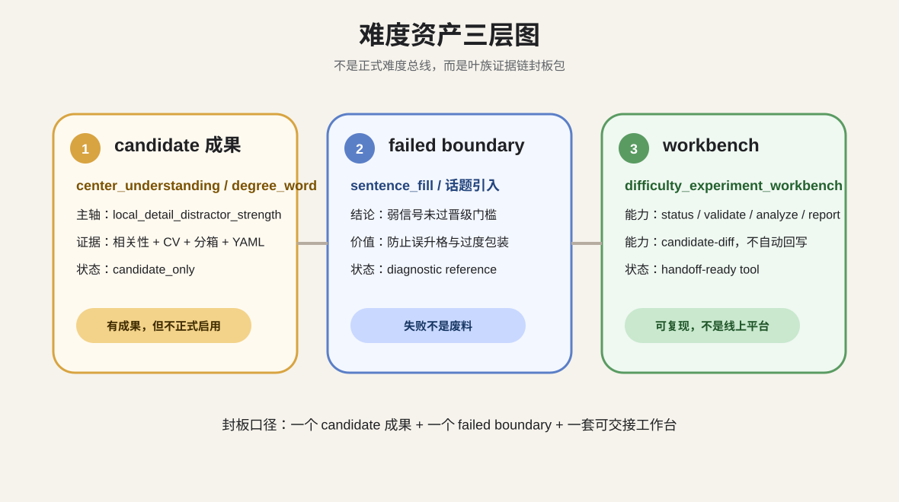
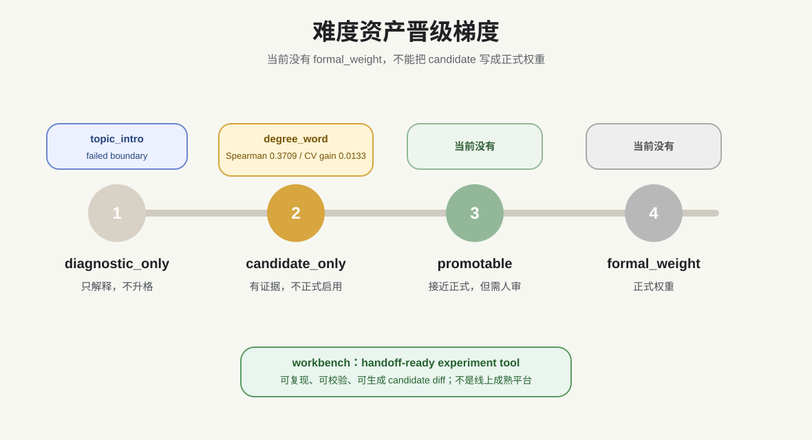

# 难度资产封板成果与当前状态

状态：closure assets
日期：2026-04-21
范围：仅说明当前仓库留下来的难度资产，不扩展到其他系统。

## 0. 当前留下了什么

当前封板资产只有三层：



| 层级 | 资产 | 状态 |
| --- | --- | --- |
| candidate 成果 | `center_understanding / degree_word` | `candidate_only` |
| failed boundary | `sentence_fill / 横线在开头-话题引入` | `failed boundary / diagnostic reference` |
| workbench | `difficulty_experiment_workbench` | `handoff-ready experiment workbench` |

边界必须写清：

```text
当前不是正式难度总线。
当前不是全题型成熟权重。
当前不是线上自动自学习。
当前不自动回写主配置。
```

## 1. candidate 成果

它是什么：

```text
center_understanding / degree_word 叶族的候选难度控制成果。
```

当前状态：

```text
candidate_only
```

主轴：

```text
local_detail_distractor_strength
```

证据：

| 指标 | 数值 |
| --- | ---: |
| 样本数 | `50` |
| Spearman | `0.3709` |
| Pearson | `0.3947` |
| permutation p | `0.0047` |
| BH q | `0.0855` |
| repeated CV MAE gain | `0.0133` |
| hard-control 当前样本数 | `5` |
| hard-control 目标样本数 | `30` |

能做什么：

- 可作为 demo 级叶族控制成果展示。
- 可作为 candidate YAML 接入 prompt / validator / diff report 的候选链路。
- 可指导后续生成 easy / medium / hard 样本时重点控制局部细节错项强度。

不能误解成什么：

- 不能叫正式权重。
- 不能叫中心理解全族控制能力。
- 不能自动写入主配置。
- 不能机械平移到其他叶族。

核心文件：

- `docs/leaf_control_box_center_understanding_degree_word.md`
- `reports/difficulty_control/highfit_probe/degree_word_correlation_analysis.md`
- `reports/difficulty_control/degree_word_leaf_experiment_report/degree_word_leaf_experiment_report.md`
- `prompt_skeleton_service/configs/prompt_assets/leaf_control_box_center_understanding_degree_word.yaml`

## 2. failed boundary

它是什么：

```text
sentence_fill / 横线在开头-话题引入 的失败边界案例。
```

当前状态：

```text
failed boundary / diagnostic reference
```

证据：

| 指标 | 数值 |
| --- | ---: |
| 样本数 | `49` |
| 叶族均值基线 CV MAE | `0.2017` |
| best model | `mapping_type_mean` |
| best model CV MAE | `0.1836` |
| best weak signal CV Spearman | `0.2215` |
| top diagnostic feature | `distractor_error.object_scope_shift` |
| top diagnostic Spearman | `0.2926` |

能做什么：

- 可作为 failed boundary 写入审计报告。
- 可提醒后续实验：弱信号、细胞层、pairwise 信号不能自动升格。
- 可说明当前工作台不是报喜工程，而是会保留失败边界。

不能误解成什么：

- 不能包装成成功叶族。
- 不能证明 sentence_fill 难度控制成熟。
- 不能因为局部弱信号好看就进入正式权重。

核心文件：

- `docs/topic_intro_difficulty_failure_diagnosis.md`
- `reports/difficulty_control/topic_intro_control_box_test/topic_intro_control_box_fit_report.md`
- `reports/difficulty_control/topic_intro_control_box_test/topic_intro_control_box_fit_report.json`

## 3. workbench

它是什么：

```text
叶族难度控制证据链工作台。
```

当前状态：

```text
handoff-ready experiment workbench
```

当前主样板叶族：

```text
center_understanding / degree_word
```

已核验支持的 stage：

| stage | 状态 |
| --- | --- |
| `status` | 可运行 |
| `validate` | 可运行，schema error 为 `0` |
| `analyze` | 可运行 |
| `report` | 可运行 |
| `candidate-diff` | 可运行，只生成候选 diff |

能做什么：

- 检查实验配置与 expected outputs。
- 校验标注输入输出。
- 复跑相关性、CV、消融与报告渲染。
- 生成 non-mutating candidate diff。

不能误解成什么：

- 不是线上训练系统。
- 不是自动打标系统。
- 不是自动学习系统。
- 不是正式难度总线。
- 不自动回写主配置。

核心文件：

- `scripts/difficulty_experiment_workbench.py`
- `configs/difficulty_experiments/center_understanding_degree_word.json`
- `configs/difficulty_experiments/template_leaf_experiment.json`
- `reports/difficulty_control/candidate_diffs/center_understanding_degree_word_candidate_diff.md`

## 4. promotion gate



当前晋级梯度：

| 等级 | 含义 | 当前资产 |
| --- | --- | --- |
| `diagnostic_only` | 只能解释、不能控制 | `topic_intro` |
| `candidate_only` | 有候选控制证据，但不能正式启用 | `degree_word` |
| `promotable` | 样本、CV、分箱、人审均接近正式启用 | 当前没有 |
| `formal_weight` | 可进入正式难度权重 | 当前没有 |

晋级门槛：

- 叶族样本数不少于 `120`。
- hard-control 样本数不少于 `30`。
- repeated CV Spearman >= `0.30`。
- MAE gain >= `0.025`。
- BH q 最好 < `0.05`；若在 `0.05-0.10`，最多保持 candidate。
- 必须人工审查 prompt / validator / diff report 消费点。

## 5. 当前封板结论

```text
degree_word 可以作为 candidate 级成果交接。
topic_intro 必须作为 failed boundary 交接。
workbench 可以作为 handoff-ready 实验工具交接。
当前没有任何资产应被表述为 formal_weight。
```
