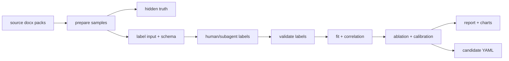

# 难度实验工作台工具化方案

状态：candidate tooling design
日期：2026-04-21
定位：把“真题回放 + 叶族难度控制”从散落脚本整理成可复跑的实验工作流。

交接入口：`docs/difficulty_workbench_and_next_steps.md`

## 1. 工具化边界

这个工作台不是线上自动学习系统，也不自动回写主配置。

它只做五件事：

1. 从真题包生成叶族实验样本和隐藏真值。
2. 生成标注输入包和 schema。
3. 校验标注回收结果。
4. 复跑相关性、CV、消融和分箱。
5. 输出实验报告和 candidate prompt assets / validator contract。

不做：

- 不自动根据实验结果改主配置。
- 不自动把 candidate 轴升格为正式权重。
- 不绕过人工/agent 阅读标注。
- 不把工作台做成线上自学习。

## 2. 推荐目录

```text
configs/difficulty_experiments/
  center_understanding_degree_word.json

scripts/
  difficulty_experiment_workbench.py

reports/difficulty_control/
  highfit_probe/
  degree_word_leaf_experiment_report/
```

## 3. 标准流水线



## 4. 实验配置字段

每个叶族实验用一个 JSON 配置描述。

核心字段：

- `experiment_id`: 实验 ID。
- `family`: 母族，例如 `center_understanding`。
- `leaf`: 叶族，例如 `degree_word`。
- `status`: `candidate_only` / `promoted` / `archived`。
- `source_packs`: 真题包来源。
- `stages`: 每个阶段要执行的脚本。
- `expected_outputs`: 每阶段应产出的关键文件。
- `label_outputs`: 需要人工或 subagent 回收的标注文件。
- `promotion_gate`: 升级门槛。

## 5. 工作台命令

当前最小 CLI：

```powershell
python scripts\difficulty_experiment_workbench.py --config configs\difficulty_experiments\center_understanding_degree_word.json --stage status
python scripts\difficulty_experiment_workbench.py --config configs\difficulty_experiments\center_understanding_degree_word.json --stage validate
python scripts\difficulty_experiment_workbench.py --config configs\difficulty_experiments\center_understanding_degree_word.json --stage analyze
python scripts\difficulty_experiment_workbench.py --config configs\difficulty_experiments\center_understanding_degree_word.json --stage report
python scripts\difficulty_experiment_workbench.py --config configs\difficulty_experiments\center_understanding_degree_word.json --stage all
python scripts\difficulty_experiment_workbench.py --config configs\difficulty_experiments\center_understanding_degree_word.json --stage candidate-diff
python scripts\difficulty_experiment_workbench.py --config configs\difficulty_experiments\template_leaf_experiment.json --stage new-experiment --new-config configs\difficulty_experiments\<new_experiment_id>.json --experiment-id <new_experiment_id> --family <family> --leaf <leaf> --leaf-display-name <leaf_display_name>
```

说明：

- `prepare` 会生成 hidden truth、label input 和 schema。
- `validate` 只检查标注文件是否存在、数量是否匹配、sample_id 是否可对齐。
- `analyze` 运行相关性与 CV 分析。
- `report` 渲染论文式报告。
- `all` 默认执行 `prepare -> validate -> fit -> analyze -> report`。
- `candidate-diff` 只生成候选变更包，不自动回写。
- `new-experiment` 从模板生成新叶族实验配置。

## 6. 当前已工具化的叶族

`center_understanding / degree_word`

已有产物：

- 叶族协议：`docs/leaf_control_box_center_understanding_degree_word.md`
- prompt assets：`prompt_skeleton_service/configs/prompt_assets/leaf_control_box_center_understanding_degree_word.yaml`
- 相关性分析：`reports/difficulty_control/highfit_probe/degree_word_correlation_analysis.md`
- 收尾报告：`reports/difficulty_control/degree_word_leaf_experiment_report/degree_word_leaf_experiment_report.md`

## 7. 为什么这套工具化有意义

难度控制最怕两件事：

- 每次探索都靠临时脚本，无法复跑。
- 得出结论后说不清变量、样本、标注和统计过程。

工作台化之后，每个叶族都能形成同样的证据链：

```text
source pack
→ hidden truth
→ label schema
→ label outputs
→ feature matrix
→ correlation / CV / ablation
→ report
→ candidate YAML
→ promotion gate
```

这让 demo 里的难度能力不是“感觉上变难了”，而是有可复查的叶族实验记录。

## 8. 后续扩展

建议下一步只扩三类能力：

1. `new-experiment`：从配置模板创建一个新叶族实验目录。
2. `label-pack`：按 N 份自动切分标注输入包。
3. `promote-candidate`：只生成 diff，不自动写主配置，由人审后再合并。

不建议现在做：

- 自动打标。
- 自动权重搜索。
- 在线自学习。
- 所有母族一起跑。
