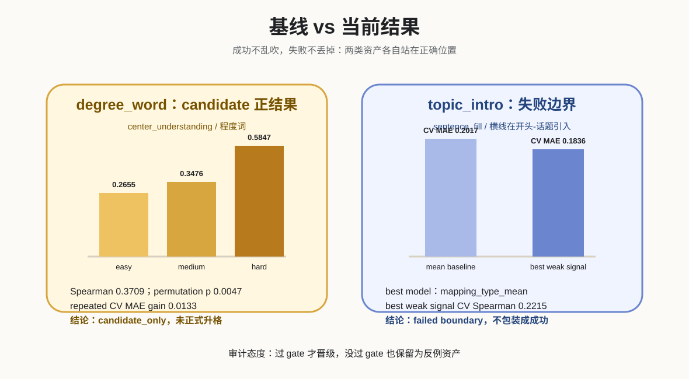

# 难度控制建设历程与阶段成果

状态：closure package / stage results
日期：2026-04-21
范围：仅覆盖当前仓库中的难度资产，不扩展到题卡蒸馏、提示词蒸馏、生题服务、材料服务或总架构。

## 0. 先定口径

当前难度资产不能被讲成“正式难度总线”。

准确口径是：

```text
当前不是正式难度总线。
当前不是全题型成熟权重。
当前不是线上自动自学习。
当前是：叶族级证据链工作台 + 一个 candidate 成果 + 一个 failed boundary。
```

这轮探索的价值不在于把所有题型一次性做完，而在于证明难度控制必须落到叶族，并且必须经过真实正确率、相关性、交叉验证、消融、分箱和候选 diff 的证据链。



## 1. 为什么要做难度控制

题目“像真题”并不等于难度有效。可交付的题卡系统至少需要回答五个问题：

| 问题 | 当前资产的回答方式 |
| --- | --- |
| 目标难度是什么 | 以叶族控制轴表达，而不是只写 easy / medium / hard |
| 实际难度是什么 | 用真题学生正确率换算 `actual_difficulty = 1 - correct_rate` |
| 难度从哪里来 | 标注可解释的 passage / option / distractor / pairwise 变量 |
| 控制轴是否有效 | 看 Spearman、Pearson、置换检验、BH q、repeated CV 和消融 |
| 不有效怎么办 | 降级为 failed boundary，不进入正式权重 |

## 2. 走过的路径

### 2.1 sentence_fill 全局结构轴

早期路线试图用全局结构信号解释句子填空难度。结果显示，结构-only 的 CV Spearman 为 `-0.0707`，不能稳定解释真实正确率排序。

阶段结论：

```text
母族级结构轴可以作为协议语言，但不能直接当成叶族难度权重。
```

### 2.2 sentence_fill 阅读型人工轴

人工阅读轴曾在 combined 设置中得到 CV Spearman `0.7353`，说明阅读型变量确实存在信号。但该结果没有严格落到单一叶族，也不能直接升格为可控权重。

阶段结论：

```text
阅读型变量有潜力，但必须继续收敛到叶族与可生成控制轴。
```

### 2.3 sentence_fill / 横线在开头-话题引入

该叶族做过多轮控制箱、细胞层、pairwise、总领命题、引句映射、完整选项集等实验。现有报告中的关键结果是：

| 项目 | 数值 |
| --- | ---: |
| 样本数 | `49` |
| 叶族均值基线 CV MAE | `0.2017` |
| 叶族均值基线 CV Spearman | `-0.0776` |
| best model | `mapping_type_mean` |
| best model CV MAE | `0.1836` |
| best weak signal CV Spearman | `0.2215` |
| top single diagnostic feature | `distractor_error.object_scope_shift` |
| top single feature Spearman | `0.2926` |

审计结论：

```text
有弱信号，但没有达到 promotion gate。
当前状态是 failed boundary / diagnostic reference。
```

这不是废料。它的阶段价值是证明：有些叶族即使有解释性变量，也不能因为训练集或弱相关好看就升格。`话题引入` 更适合作为防误升格案例，提醒后续不要把“诊断语言”误当成“稳定难度成因语言”。

### 2.4 center_understanding / degree_word

该叶族最终形成当前唯一 candidate 成果。

主控制轴：

```text
local_detail_distractor_strength
```

含义：

```text
易错项是否抓住原文局部细节，但不能覆盖全文中心。
```

关键数据来自 `reports/difficulty_control/highfit_probe/degree_word_correlation_analysis.json` 与叶族收尾报告：

| 项目 | 数值 |
| --- | ---: |
| 样本数 | `50` |
| Spearman | `0.3709` |
| Pearson | `0.3947` |
| permutation p | `0.0047` |
| Bootstrap 95% CI | `[0.1099, 0.5800]` |
| BH q | `0.0855` |
| repeated 5-fold CV MAE gain | `0.0133` |
| repeated 5-fold CV Spearman | `0.2159` |
| hard-control 当前样本数 | `5` |
| hard-control 平均真实难度 | `0.5847` |
| hard-control 目标样本数 | `30` |

阶段结论：

```text
degree_word 已形成 candidate_only 成果。
它有方向一致的统计证据，也能映射到 prompt / validator / diff report。
但当前仍不能叫 formal weight。
```

## 3. 阶段成果

| 资产 | 当前状态 | 为什么保留 |
| --- | --- | --- |
| `center_understanding / degree_word` | `candidate_only` | 有真实正确率方向一致证据、CV 正增益、候选 YAML 和报告 |
| `sentence_fill / 话题引入` | `failed boundary / diagnostic reference` | 未过晋级门槛，但能防止弱信号误升格 |
| `difficulty_experiment_workbench` | `handoff-ready experiment workbench` | 可复现 status / validate / analyze / report / candidate-diff |

## 4. 阶段结论

当前难度控制已经从“凭感觉调难度”推进到“叶族级证据链控制”的 demo 阶段。

更克制地说：

```text
我们已经证明某些叶族可以形成可解释、可验证、可候选接入的难度控制轴。
我们也已经证明某些叶族不能被弱信号误升格。
下一阶段应扩样本、补 hard 档、稳住 candidate，而不是横向铺开更多未经验证的轴。
```

## 5. 技术附录入口

degree_word 的高信息密度图不放在主叙事里堆砌，统一收在：

```text
docs/difficulty_degree_word_technical_appendix.md
```
