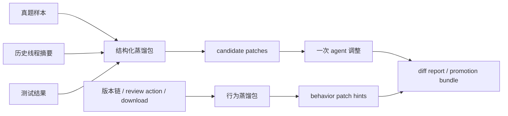
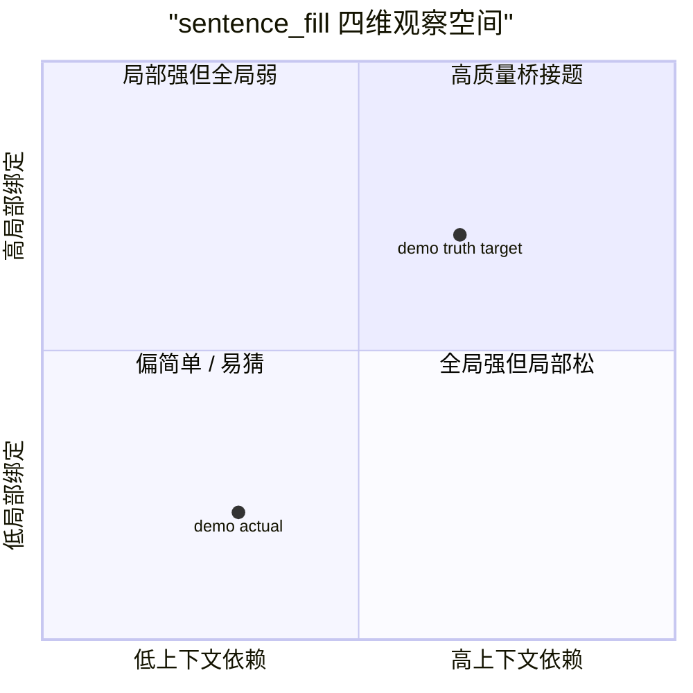
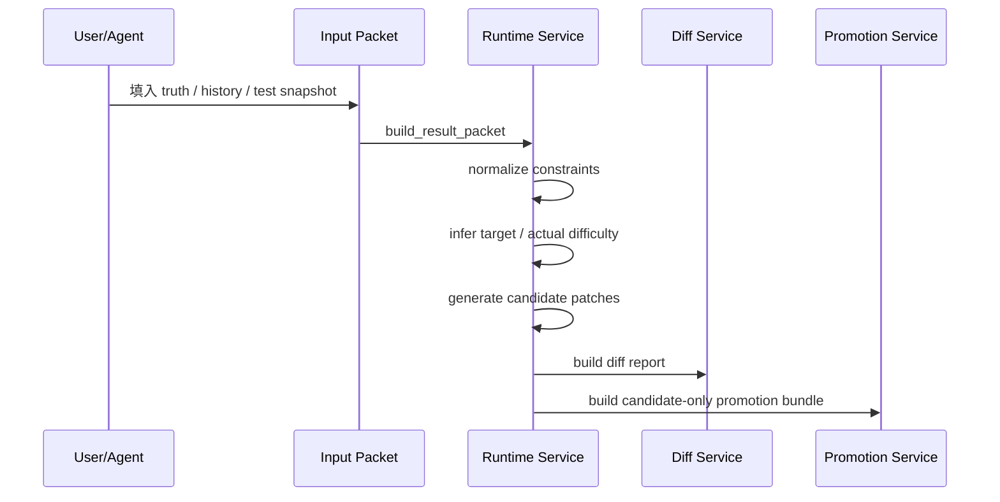
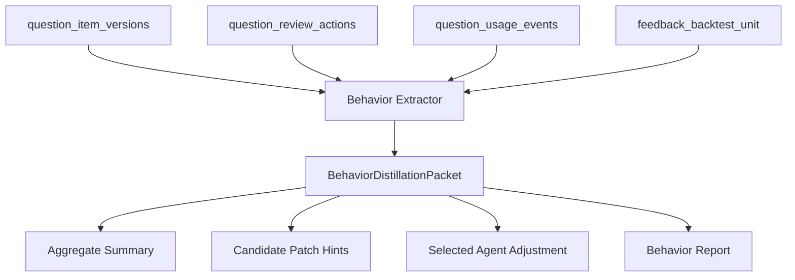
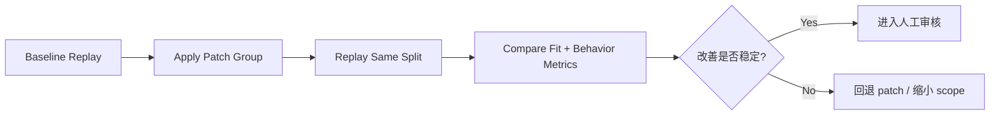
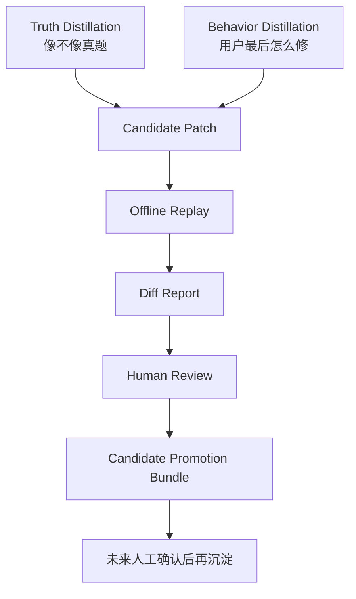

# 题卡与提示词蒸馏运行层收尾报告

## 摘要

本报告总结当前仓库在短周期内完成的“题卡 / prompt / validator / material mapping 蒸馏运行层”建设成果。项目目标不是训练新模型，也不是开启线上自动自学习，而是在现有“双服务 + 外置卡片/配置 + 单页工作台”结构上，建立一条可运行、可解释、可审计、可交接的离线蒸馏闭环。

本轮重点完成两条蒸馏链路：

1. `truth distillation`
   以真题样本、历史调试摘要和测试结果为输入，生成结构化蒸馏包、candidate patches、一次 agent 调整建议和 diff report。

2. `behavior distillation`
   以用户历史版本链、review action、download/use event 为输入，生成行为蒸馏包、聚合摘要、candidate patch hints、行为报告和下一步建议。

当前范围严格限定为：

- 先支持 `sentence_fill`
- 只做离线闭环
- 只生成 candidate patch，不自动回写主配置
- 只补最小难度观察维度
- 只做最小测试，不宣称全量统计显著性

## 1. 背景与问题定义

### 1.1 原始问题

当前题目生成系统的核心难点不是“能不能生成一道题”，而是：

- 生成题是否稳定贴近真题风格
- 题卡、prompt、validator、材料映射之间的责任边界是否清楚
- agent 与人工反复调试的过程是否可以沉淀
- 用户最终修改和拿走的版本是否能反过来指导后续题卡演进

过去的蒸馏过程更像“人和 agent 在聊天里调 prompt”，优点是快，缺点是难交接、难回放、难比较。

本轮目标是把这个过程转成正式运行层：



### 1.2 双服务边界

本轮没有重构主链路，而是尊重现有结构：

- `passage_service`
  负责材料侧处理、材料池、候选材料、材料标签与检索。

- `prompt_skeleton_service`
  负责题型协议、题卡消耗、出题、评审、版本记录和蒸馏运行层。

本轮新增层位于 `prompt_skeleton_service`，但只作为离线蒸馏运行层，不替代题卡协议本身。

## 2. 系统对象与变量定义

### 2.1 核心对象

| 对象 | 含义 | 当前状态 |
| --- | --- | --- |
| `distillation_input_packet` | 真题蒸馏输入包 | 已实现 |
| `distillation_result_packet` | 真题蒸馏结果包 | 已实现 |
| `candidate_patch` | 候选 patch，不自动回写 | 已实现 |
| `promotion_bundle` | candidate-only 沉淀包 | 已实现 |
| `distillation_diff_report` | 目标/实际拟合差异报告 | 已实现 |
| `behavior_distillation_packet` | 用户历史行为蒸馏包 | 已实现 |
| `behavior_candidate_patch_hints` | 从用户修题轨迹推导的候选 patch hints | 已实现 |
| `behavior_distillation_report` | 行为蒸馏审计报告 | 已实现 |

### 2.2 `sentence_fill` 最小难度变量

本轮没有做全局难度总线，只为 `sentence_fill` 定义 4 个观察变量。

| 变量 | 记号 | 含义 | 主要来源 |
| --- | --- | --- | --- |
| `local_binding_complexity` | LBC | 空句与前后句之间的局部绑定复杂度 | blank position、bidirectional validation、reference dependency |
| `global_context_dependency` | GCD | 正确项是否依赖段落级 / 全文级语境 | semantic scope、context dependency、材料长度 |
| `distractor_similarity` | DS | 错误项与正确项的竞争程度 | 选项相似度、distractor strength、人工改 options 频率 |
| `blank_function_ambiguity` | BFA | 空位功能是否容易混淆 | function type、logic relation、analysis 修改频率 |

每个变量取值范围为 `0.0 ~ 1.0`。



### 2.3 行为蒸馏变量

行为蒸馏关注用户真实修题路径。

| 变量 | 含义 |
| --- | --- |
| `accepted_direct_rate` | 直接通过率 |
| `accepted_after_edit_rate` | 修改后保留率 |
| `discard_rate` | 丢弃率 |
| `download_rate` | 最终被下载 / 拿走比例 |
| `truth_touched_rate` | 用户动作是否触碰 truth-like 字段 |
| `material_boundary_cross_rate` | 用户动作是否跨材料边界 |
| `top_changed_fields` | 高频改动字段 |
| `top_failed_thresholds` | 高频失败阈值 |

## 3. 实验过程

### 3.1 实验 1：真题蒸馏最小闭环

输入：

- 一条 `sentence_fill` 真题样本
- 一段历史调试摘要
- 一份测试结果快照
- 当前 runtime state 快照

过程：



输出：

- `distillation_input_packet.json`
- `distillation_result_packet.json`
- `distillation_promotion_bundle.json`
- `distillation_diff_report.json`
- `distillation_diff_report.md`

当前 demo round 结果：

| 指标 | 结果 |
| --- | --- |
| `overall_fit_status` | `poor` |
| `candidate_patch_count` | `16` |
| `local_binding_complexity` | `under_target` |
| `global_context_dependency` | `under_target` |
| `distractor_similarity` | `under_target` |
| `blank_function_ambiguity` | `under_target` |

说明：demo round 有意保留明显差距，用于验证 diff 和 patch 生成能力。

### 3.2 实验 2：行为蒸馏闭环

输入：

- `question_item_versions`
- `question_review_actions`
- `question_usage_events`
- review action 内的 `feedback_backtest_unit`

过程：



输出：

- 行为聚合摘要
- 高频改动字段
- 高频动作类型
- 高频失败阈值
- candidate patch hints
- selected agent adjustment
- behavior report

前端入口：

- `/demo/distill`
- 左侧 `7. 历史动作蒸馏`
- 右侧 `行为蒸馏包`

### 3.3 验证结果

当前已跑测试：

```text
python -m pytest tests\test_distillation_behavior_service.py tests\test_distillation_runtime_service.py tests\test_distillation_promotion_service.py tests\test_distillation_diff_service.py tests\test_demo_shell.py
```

结果：

```text
13 passed
```

## 4. 相关性分析设计

注意：当前样本仍处在工程封板和小样本验证阶段，以下是“已实现可观测变量之间的相关性分析设计”，不是对大样本显著性的最终声明。

### 4.1 核心相关性假设

| 假设 | 自变量 | 因变量 | 预期方向 |
| --- | --- | --- | --- |
| H1 | `distractor_similarity` 偏低 | `options` 人工改动频率 | 正相关 |
| H2 | `blank_function_ambiguity` 偏低或偏高 | `analysis` 人工改动频率 | 正相关 |
| H3 | `global_context_dependency` 偏低 | `material_boundary_cross_rate` | 正相关 |
| H4 | `local_binding_complexity` 偏低 | `truth_touched_rate` | 正相关 |
| H5 | `candidate_patch_hints` 命中高频改动字段 | 下一轮 `accepted_after_edit_rate` | 负相关 |

### 4.2 相关性观察矩阵

| 观察变量 | 行为信号 | 解释 |
| --- | --- | --- |
| `DS under_target` | `options` 高频修改 | 干扰项不像真题，用户需要重修选项 |
| `BFA mismatch` | `analysis` 高频修改 | 空位功能解释不稳，解析需要人工兜底 |
| `GCD under_target` | 材料边界被跨 | 材料不能支撑段落级判断 |
| `LBC under_target` | truth-like 字段被碰 | 局部绑定不足导致题面或答案层需要修 |

### 4.3 后续统计方式

当样本量达到可用规模后，建议计算：

- Pearson / Spearman 相关性
- 按题卡分组的 edit-rate 差异
- patch 前后 `accepted_after_edit_rate` 的下降幅度
- `download_rate` 对 `review outcome` 的条件概率

## 5. 消融实验设计

本轮没有做大规模真实消融，但已经把消融位点设计成可执行对象。

### 5.1 消融对象

| 消融项 | 关闭内容 | 观察指标 |
| --- | --- | --- |
| A0 baseline | 不使用蒸馏 patch | 原始 fit status、edit rate |
| A1 no question card patch | 禁用题卡 patch hints | truth_touched_rate 是否下降失败 |
| A2 no prompt asset patch | 禁用 prompt guard hints | options / analysis 修改率是否下降失败 |
| A3 no validator patch | 禁用 validator contract hints | threshold failure 是否继续高发 |
| A4 no material mapping patch | 禁用 material mapping hints | material_boundary_cross_rate 是否继续高发 |
| A5 truth-only | 只用真题蒸馏 | 用户行为指标是否仍不改善 |
| A6 behavior-only | 只用行为蒸馏 | 真题拟合是否可能漂移 |

### 5.2 消融判断

推荐判断方式：



### 5.3 当前可做的最小消融

当前已经具备条件做以下最小消融：

1. 只应用 `prompt_assets` hints
2. 只应用 `validator_contract` hints
3. 只应用 `question_card` hints
4. 对比 `diff report` 与 `behavior report`

## 6. 样本边际与稳定性

### 6.1 当前样本边际

当前阶段是工程闭环验证，不能声称统计收敛。

| 样本量 | 可做判断 | 不建议做判断 |
| --- | --- | --- |
| `n < 30` | 流程打通、字段是否足够、典型 case 审计 | 全局结论 |
| `30 <= n < 100` | 方向性观察、高频问题初筛 | 上线级自动回写 |
| `100 <= n < 300` | 按题卡看稳定模式、做小规模消融 | 全题型泛化 |
| `n >= 300` | 分题卡 / 分材料类型回放，建立候选阈值 | 无人工审核自动上线 |

### 6.2 推荐沉淀规模

对 `sentence_fill` 建议：

- 每个子卡先收 `30-50` 条真题样本
- 每个题卡至少收 `50+` 条 review action
- 每个 patch group 至少做 `2` 轮离线回放
- test split 不参与调参，只用于冻结验证

### 6.3 边际收益判断

当新增样本带来的 top problem 排名基本不变时，说明进入边际稳定区。

可观察信号：

- `top_changed_fields` 连续两轮排序稳定
- `top_failed_thresholds` 连续两轮排序稳定
- candidate patch hints 连续两轮指向同一 target
- patch 后 `accepted_after_edit_rate` 明显下降

## 7. 当前成果

### 7.1 工程成果

| 成果 | 状态 |
| --- | --- |
| 真题蒸馏 schema | 完成 |
| 真题蒸馏 runtime service | 完成 |
| candidate patch 生成 | 完成 |
| diff report | 完成 |
| promotion bundle | 完成 |
| prompt assets 外置 | 完成 |
| 行为蒸馏 schema | 完成 |
| 行为蒸馏 extractor | 完成 |
| 行为 patch hints | 完成 |
| 行为蒸馏报告 | 完成 |
| 前端训练页入口 | 完成 |
| 最小测试 | 完成 |

### 7.2 方法成果

本轮形成了一个重要范式：

> 蒸馏不是让 agent 在线自学习，而是让 agent 在可控项内离线提出候选修改，再由 diff、测试和人工审核决定是否沉淀。

这条范式避免了三类风险：

- prompt 越调越散
- 题卡语义逃逸到 service 深处
- 用户行为被直接当成线上规则更新

## 8. 踩过的坑

### 8.1 不要把“调 prompt”当成唯一蒸馏对象

早期容易把所有问题都归因到 prompt，但实际问题可能来自：

- 题卡默认槽位
- 材料映射
- validator contract
- prompt guard
- 用户最终使用偏好

因此 candidate patch 必须分 target。

### 8.2 不要把 test split 当调参集

test 只能冻结验证，不能反复拿来调 prompt。

否则会出现：

- dev/test 泄漏
- 拟合特定样本
- 后续题卡泛化失败

### 8.3 不要让 service 重新发明题型规则

本轮刻意把蒸馏 prompt 放在：

```text
prompt_skeleton_service/configs/prompt_assets/truth_distillation_prompt_assets.yaml
```

service 只执行，不把基础映射语句塞回深层逻辑。

### 8.4 行为数据不能直接等价于真理

用户改题行为很有价值，但它代表“使用偏好 / 人工兜底模式”，不一定代表真题标准。

因此需要两条链互相校验：

- truth distillation 防止偏离真题
- behavior distillation 防止忽视真实使用路径

### 8.5 不要过早扩全题型

当前只做 `sentence_fill` 是正确的。

原因：

- 结构依赖强
- 材料映射问题暴露明显
- 错误项质量可被行为数据反向验证

## 9. 后续方向

### 9.1 联合审计页

下一步最推荐：

```text
truth distillation report + behavior distillation report
```

合并成一个联合审计页，直接看两条链是否指向同一组 patch target。

### 9.2 真实样本接入

用真实 `sentence_fill` 样本替换 demo packet：

- 按子卡组织
- 保留 train/dev/test
- 每轮固定 split
- 输出版本化报告

### 9.3 Patch 审核队列

把 candidate patch hints 变成可审核队列：

- `proposed`
- `accepted`
- `rejected`
- `needs_more_evidence`

### 9.4 消融回放

对同一批样本跑：

- baseline
- prompt-only
- validator-only
- material-only
- combined

### 9.5 扩展到第二题型

等 `sentence_fill` 稳定后，再考虑：

- `sentence_order`
- `main_idea`

但扩展前必须先补对应 family difficulty protocol。

## 10. 结论

本轮工作已经把蒸馏从“人和 agent 在聊天中不断调试”推进到“可运行、可审计、可交接的离线运行层”。

当前最重要的成果不是某一个 prompt 更好了，而是系统现在能够回答：

- 为什么这轮要改
- 改的是哪个 target
- 改动依据来自真题还是用户行为
- 当前拟合差距在哪
- 哪些 patch 只是候选
- 哪些结果需要人工审核
- 下一轮应该怎么验证

最终形成两条互补路线：



这为后续维护者铺好了路：先稳住 `sentence_fill`，再用同样协议扩题型；先离线蒸馏，再人工审核；先形成 candidate bundle，再考虑正式配置回写。
