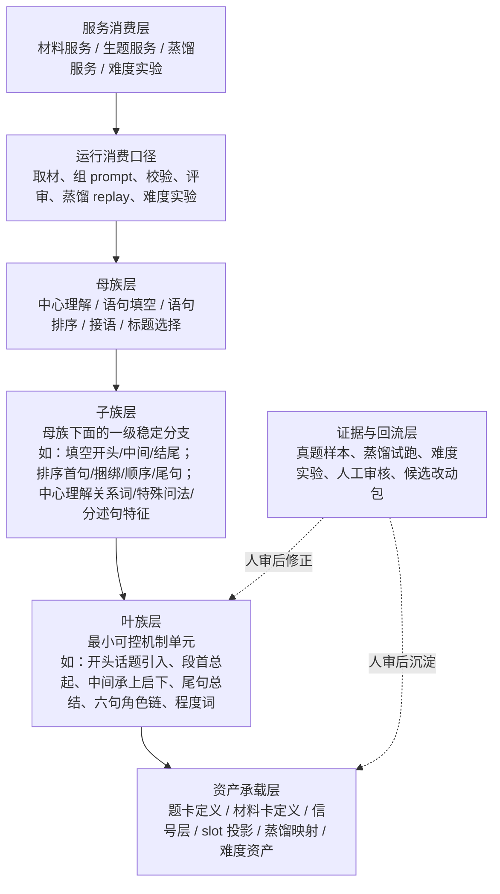

# 母族-子族-叶族消费架构图源稿

> 这张图按“业务认知 + 消费路径”组织：母族、子族、叶族是主结构；题卡、材料卡、信号层、slot 投影、蒸馏映射只是承载资产。

```mermaid
flowchart TB
  Service["服务消费层\n材料服务 / 生题服务 / 蒸馏服务 / 难度实验"]

  Runtime["运行消费口径\n取材、组 prompt、校验、评审、蒸馏 replay、难度实验"]

  Mother["母族层\n中心理解 / 语句填空 / 语句排序 / 接语 / 标题选择"]

  Child["子族层\n母族下面的一级稳定分支\n如：填空开头/中间/结尾；排序首句/捆绑/顺序/尾句；中心理解关系词/特殊问法/分述句特征"]

  Leaf["叶族层\n最小可控机制单元\n如：开头话题引入、段首总起、中间承上启下、尾句总结、六句角色链、程度词"]

  Assets["资产承载层\n题卡定义 / 材料卡定义 / 信号层 / slot 投影 / 蒸馏映射 / 难度资产"]

  Evidence["证据与回流层\n真题样本、蒸馏试跑、难度实验、人工审核、候选改动包"]

  Service --> Runtime --> Mother --> Child --> Leaf --> Assets
  Evidence -. 人审后修正 .-> Leaf
  Evidence -. 人审后沉淀 .-> Assets
```
