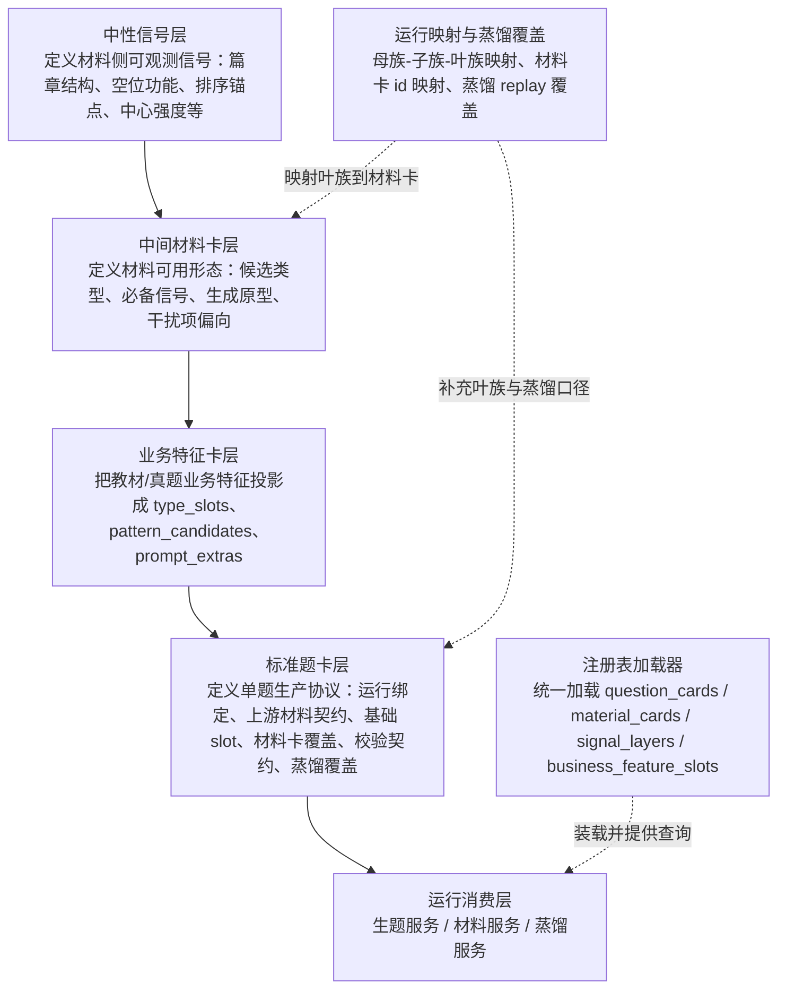

# 题卡体系架构图源稿

> 这张是当前题卡体系的静态架构图。它表达“题卡协议栈”的从属关系，不表达一次运行流程。

```mermaid
flowchart TB
  Runtime["运行消费层\n生题服务 / 材料服务 / 蒸馏服务"]

  Question["标准题卡层\n定义单题生产协议：运行绑定、上游材料契约、基础 slot、材料卡覆盖、校验契约、蒸馏覆盖"]

  Business["业务特征卡层\n把教材/真题业务特征投影成 type_slots、pattern_candidates、prompt_extras"]

  Material["中间材料卡层\n定义材料可用形态：候选类型、必备信号、生成原型、干扰项偏向"]

  Signal["中性信号层\n定义材料侧可观测信号：篇章结构、空位功能、排序锚点、中心强度等"]

  Mapping["运行映射与蒸馏覆盖\n母族-子族-叶族映射、材料卡 id 映射、蒸馏 replay 覆盖"]

  Registry["注册表加载器\n统一加载 question_cards / material_cards / signal_layers / business_feature_slots"]

  Signal --> Material --> Business --> Question --> Runtime
  Mapping -. 补充叶族与蒸馏口径 .-> Question
  Mapping -. 映射叶族到材料卡 .-> Material
  Registry -. 装载并提供查询 .-> Runtime
```
