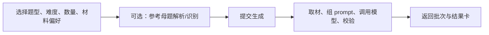
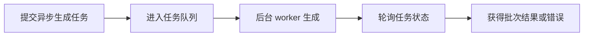
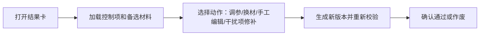
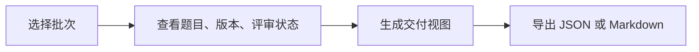
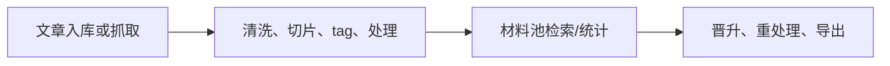
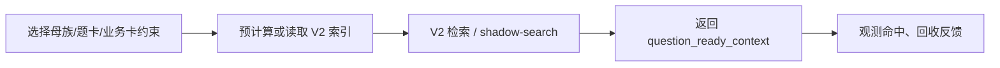
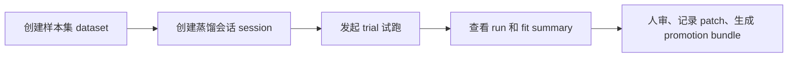
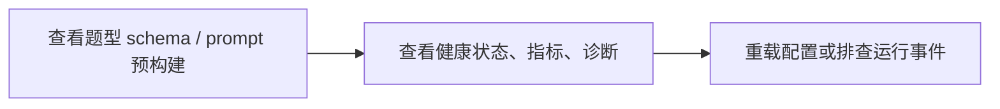

# 对外功能流程梳理

> 这份只梳理对外功能，不展开内部模块实现。

## 1. 出题生成

```mermaid
flowchart LR
  A["选择题型、难度、数量、材料偏好"] --> B["可选：参考母题解析/识别"]
  B --> C["提交生成"]
  C --> D["取材、组 prompt、调用模型、校验"]
  D --> E["返回批次与结果卡"]
```

## 2. 异步生成

```mermaid
flowchart LR
  A["提交异步生成任务"] --> B["进入任务队列"]
  B --> C["后台 worker 生成"]
  C --> D["轮询任务状态"]
  D --> E["获得批次结果或错误"]
```

## 3. 结果评审与修改

```mermaid
flowchart LR
  A["打开结果卡"] --> B["加载控制项和备选材料"]
  B --> C["选择动作：调参/换材/手工编辑/干扰项修补"]
  C --> D["生成新版本并重新校验"]
  D --> E["确认通过或作废"]
```

## 4. 交付导出

```mermaid
flowchart LR
  A["选择批次"] --> B["查看题目、版本、评审状态"]
  B --> C["生成交付视图"]
  C --> D["导出 JSON 或 Markdown"]
```

## 5. 材料库维护

```mermaid
flowchart LR
  A["文章入库或抓取"] --> B["清洗、切片、tag、处理"]
  B --> C["材料池检索/统计"]
  C --> D["晋升、重处理、导出"]
```

## 6. 材料 V2 与材料卡收路

```mermaid
flowchart LR
  A["选择母族/题卡/业务卡约束"] --> B["预计算或读取 V2 索引"]
  B --> C["V2 检索 / shadow-search"]
  C --> D["返回 question_ready_context"]
  D --> E["观测命中、回收反馈"]
```

## 7. 蒸馏工作台

```mermaid
flowchart LR
  A["创建样本集 dataset"] --> B["创建蒸馏会话 session"]
  B --> C["发起 trial 试跑"]
  C --> D["查看 run 和 fit summary"]
  D --> E["人审、记录 patch、生成 promotion bundle"]
```

## 8. 配置、诊断与观测

```mermaid
flowchart LR
  A["查看题型 schema / prompt 预构建"] --> B["查看健康状态、指标、诊断"]
  B --> C["重载配置或排查运行事件"]
```
