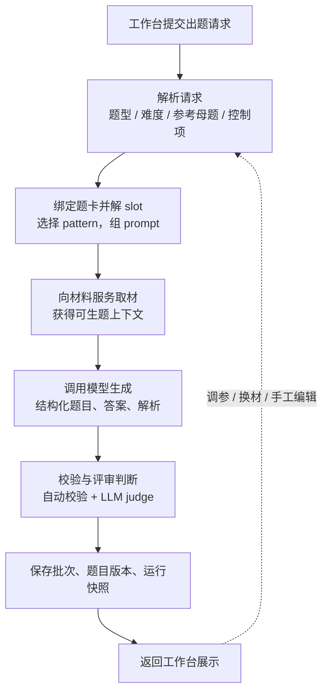
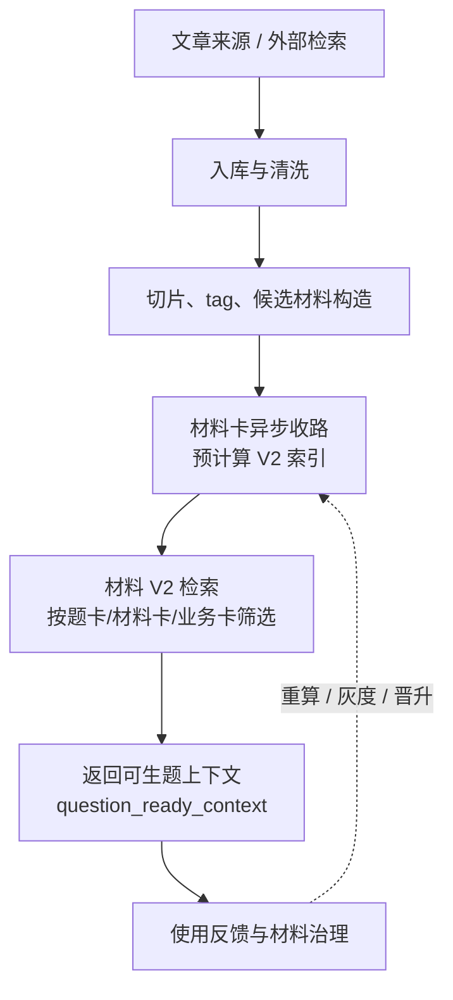
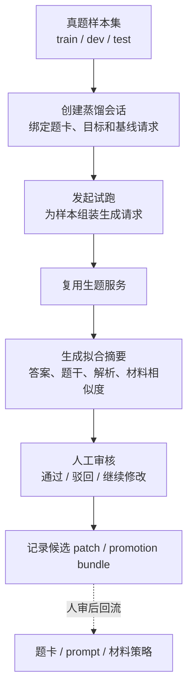
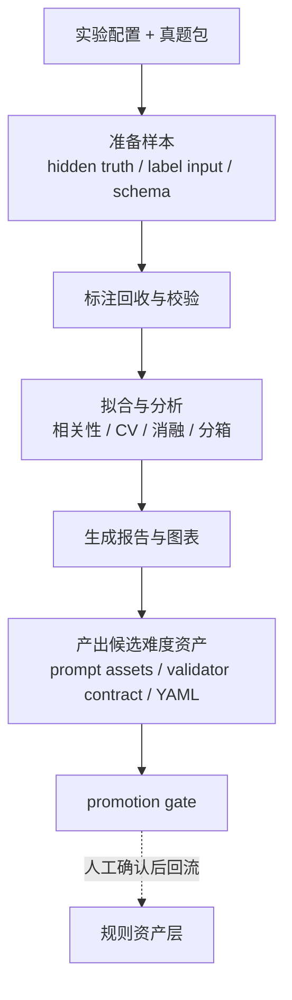

# 四个服务流程图源稿

## 生题服务流程

```mermaid
flowchart TB
  A["工作台提交出题请求"] --> B["解析请求\n题型 / 难度 / 参考母题 / 控制项"]
  B --> C["绑定题卡并解 slot\n选择 pattern，组 prompt"]
  C --> D["向材料服务取材\n获得可生题上下文"]
  D --> E["调用模型生成\n结构化题目、答案、解析"]
  E --> F["校验与评审判断\n自动校验 + LLM judge"]
  F --> G["保存批次、题目版本、运行快照"]
  G --> H["返回工作台展示"]
  H -. "调参 / 换材 / 手工编辑" .-> B
```

## 材料服务流程

```mermaid
flowchart TB
  A["文章来源 / 外部检索"] --> B["入库与清洗"]
  B --> C["切片、tag、候选材料构造"]
  C --> D["材料卡异步收路\n预计算 V2 索引"]
  D --> E["材料 V2 检索\n按题卡/材料卡/业务卡筛选"]
  E --> F["返回可生题上下文\nquestion_ready_context"]
  F --> G["使用反馈与材料治理"]
  G -. "重算 / 灰度 / 晋升" .-> D
```

## 蒸馏服务流程

```mermaid
flowchart TB
  A["真题样本集\ntrain / dev / test"] --> B["创建蒸馏会话\n绑定题卡、目标和基线请求"]
  B --> C["发起试跑\n为样本组装生成请求"]
  C --> D["复用生题服务"]
  D --> E["生成拟合摘要\n答案、题干、解析、材料相似度"]
  E --> F["人工审核\n通过 / 驳回 / 继续修改"]
  F --> G["记录候选 patch / promotion bundle"]
  G -. "人审后回流" .-> H["题卡 / prompt / 材料策略"]
```

## 难度实验工具流程

```mermaid
flowchart TB
  A["实验配置 + 真题包"] --> B["准备样本\nhidden truth / label input / schema"]
  B --> C["标注回收与校验"]
  C --> D["拟合与分析\n相关性 / CV / 消融 / 分箱"]
  D --> E["生成报告与图表"]
  E --> F["产出候选难度资产\nprompt assets / validator contract / YAML"]
  F --> G["promotion gate"]
  G -. "人工确认后回流" .-> H["规则资产层"]
```
