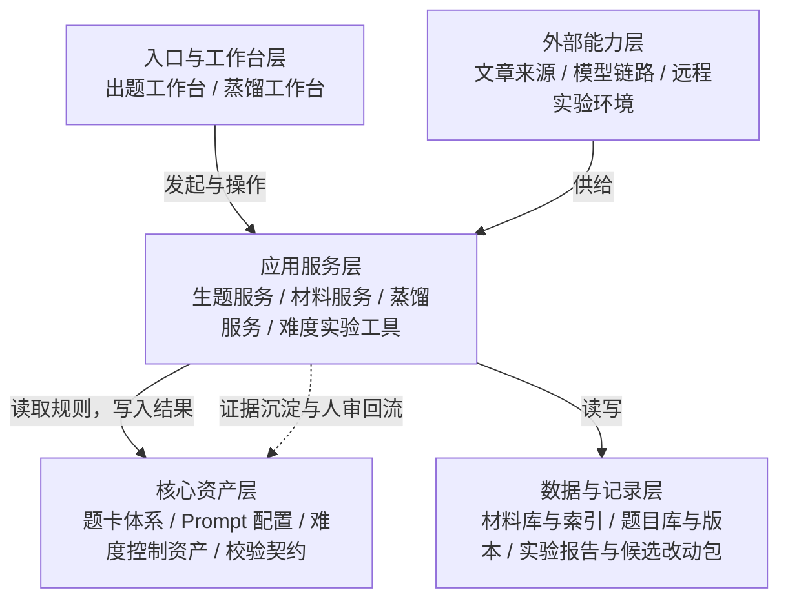

# 分层总架构图源稿

> 架构图采用层级大块和少量上下箭头，只表达推进关系与从属关系。

```mermaid
flowchart TB
  UI["入口与工作台层\n出题工作台 / 蒸馏工作台"]

  Service["应用服务层\n生题服务 / 材料服务 / 蒸馏服务 / 难度实验工具"]

  Assets["核心资产层\n题卡体系 / Prompt 配置 / 难度控制资产 / 校验契约"]

  Data["数据与记录层\n材料库与索引 / 题目库与版本 / 实验报告与候选改动包"]

  External["外部能力层\n文章来源 / 模型链路 / 远程实验环境"]

  UI -->|发起与操作| Service
  Service -->|读取规则，写入结果| Assets
  Service -->|读写| Data
  External -->|供给| Service
  Service -. 证据沉淀与人审回流 .-> Assets
```
