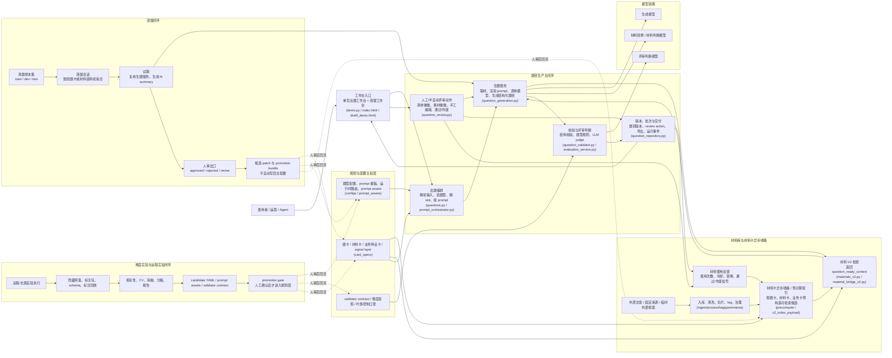

# 总服务闭环架构图源稿

> 本图只画全局闭环，不展开单个子系统。后续再分别拆：题卡、生题服务、材料库、蒸馏台、难度实验。

```mermaid
flowchart LR
  User["使用者 / 运营 / Agent"] --> Workbench["工作台入口\n单页出题工作台 + 蒸馏工作台\n(demo.py / index.html / distill_demo.html)"]

  subgraph MainLoop["题目生产主闭环"]
    Orchestrate["出题编排\n解析输入、选题型、解 slot、组 prompt\n(questions.py / prompt_orchestrator.py)"]
    Generate["生题服务\n取材、渲染 prompt、调用模型、生成结构化题目\n(question_generation.py)"]
    Validate["校验与评审判断\n结构校验、题型规则、LLM judge\n(question_validator.py / evaluation_service.py)"]
    Review["人工/半自动评审动作\n调参重做、换材重做、手工编辑、通过/作废\n(question_review.py)"]
    Delivery["版本、批次与交付\n题目版本、review action、导出、运行事件\n(question_repository.py)"]
  end

  subgraph MaterialLoop["材料库与材料卡异步收路"]
    Source["外部文章 / 固定来源 / 临时外部检索"]
    Ingest["入库、清洗、切片、tag、治理\n(ingest/process/tag/governance)"]
    AsyncCard["材料卡异步收路 / 预计算索引\n按题卡、材料卡、业务卡预构造可检索候选\n(precompute / v2_index_payload)"]
    Search["材料 V2 检索\n返回 question_ready_context\n(materials_v2.py / material_bridge_v2.py)"]
    Feedback["材料使用反馈\n使用次数、冷却、替换、通过/作废信号"]
  end

  subgraph RuleLayer["规则与配置主权层"]
    Cards["题卡 / 材料卡 / 业务特征卡 / signal layer\n(card_specs)"]
    PromptCfg["题型配置、prompt 模板、运行时路由、prompt assets\n(configs / prompt_assets)"]
    Contracts["validator contract / 难度投影 / 叶族控制口径"]
  end

  subgraph DistillLoop["蒸馏闭环"]
    Dataset["真题样本集\ntrain / dev / test"]
    Session["蒸馏会话\n围绕题卡或材料链持续拟合"]
    Trial["试跑\n复用生题服务，生成 fit summary"]
    DistillReview["人审出口\napproved / rejected / revise"]
    Patch["候选 patch 与 promotion bundle\n不自动写回主配置"]
  end

  subgraph DifficultyLoop["难度实验与远程实验闭环"]
    Remote["远程/长跑实验执行"]
    Labeling["隐藏真值、标注包、schema、标注回收"]
    Fit["相关性、CV、消融、分箱、报告"]
    Candidate["candidate YAML / prompt assets / validator contract"]
    Gate["promotion gate\n人工确认后才进入规则层"]
  end

  subgraph ModelLayer["模型链路"]
    GenLLM["生成模型"]
    MatLLM["材料轻修 / 材料判断模型"]
    JudgeLLM["评审判断模型"]
  end

  Workbench --> Orchestrate --> Generate
  Generate --> Search --> Generate
  Generate --> GenLLM
  Generate --> MatLLM
  Generate --> Validate --> JudgeLLM
  Validate --> Delivery --> Workbench
  Workbench --> Review --> Generate
  Review --> Delivery

  Source --> Ingest --> AsyncCard --> Search
  Cards --> AsyncCard
  Cards --> Search
  PromptCfg --> Orchestrate
  Cards --> Orchestrate
  Contracts --> Validate

  Delivery --> Feedback --> AsyncCard
  Review --> Feedback

  Dataset --> Session --> Trial --> Generate
  Trial --> DistillReview --> Patch
  Patch -. 人审后回流 .-> Cards
  Patch -. 人审后回流 .-> PromptCfg
  Patch -. 人审后回流 .-> AsyncCard

  Remote --> Labeling --> Fit --> Candidate --> Gate
  Gate -. 人审后回流 .-> PromptCfg
  Gate -. 人审后回流 .-> Contracts
  Gate -. 人审后回流 .-> Cards
```
