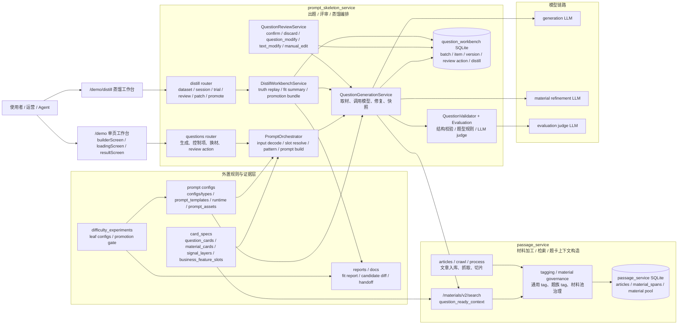
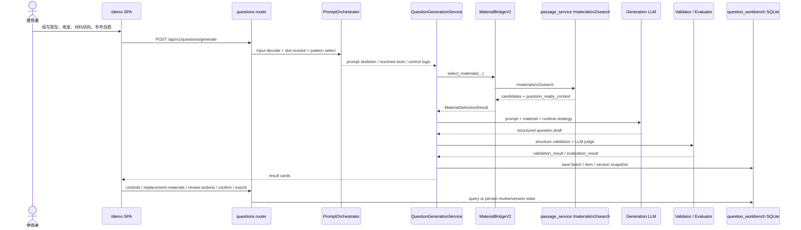
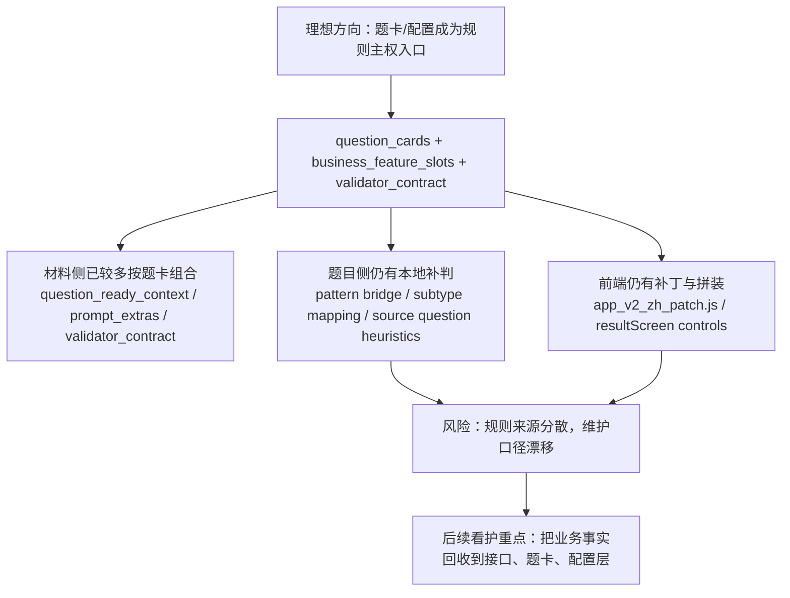

# 项目架构图与流程图源稿

> 目标：给 Figma 画板提供可复刻的结构源稿。当前项目不是单一出题接口，而是“题目生产主链 + 材料服务 + 蒸馏闭环 + 难度实验工作台”的组合系统。

## 1. 系统架构总览

```mermaid
flowchart LR
  User["使用者 / 运营 / Agent"] --> Demo["/demo 单页工作台\nbuilderScreen / loadingScreen / resultScreen"]
  User --> DistillUI["/demo/distill 蒸馏工作台"]

  subgraph Prompt["prompt_skeleton_service\n出题 / 评审 / 蒸馏编排"]
    QRouter["questions router\n生成、控制项、换材、review action"]
    DRouter["distill router\ndataset / session / trial / review / patch / promote"]
    Orchestrator["PromptOrchestrator\ninput decode / slot resolve / pattern / prompt build"]
    Generation["QuestionGenerationService\n取材、调用模型、修复、快照"]
    Review["QuestionReviewService\nconfirm / discard / question_modify / text_modify / manual_edit"]
    Distill["DistillWorkbenchService\ntruth replay / fit summary / promotion bundle"]
    Validator["QuestionValidator + Evaluation\n结构校验 / 题型规则 / LLM judge"]
    QDB[("question_workbench SQLite\nbatch / item / version / review action / distill")]
  end

  subgraph Passage["passage_service\n材料加工 / 检索 / 题卡上下文构造"]
    Ingest["articles / crawl / process\n文章入库、抓取、切片"]
    Tag["tagging / material governance\n通用 tag、题族 tag、材料池治理"]
    MatV2["/materials/v2/search\nquestion_ready_context"]
    PDB[("passage_service SQLite\narticles / material_spans / material pool")]
  end

  subgraph Config["外置规则与证据层"]
    Cards["card_specs\nquestion_cards / material_cards / signal_layers / business_feature_slots"]
    PromptCfg["prompt configs\nconfigs/types / prompt_templates / runtime / prompt_assets"]
    DiffExp["difficulty_experiments\nleaf configs / promotion gate"]
    Reports["reports / docs\nfit report / candidate diff / handoff"]
  end

  subgraph LLM["模型链路"]
    GenLLM["generation LLM"]
    MatLLM["material refinement LLM"]
    JudgeLLM["evaluation judge LLM"]
  end

  Demo --> QRouter
  DistillUI --> DRouter
  QRouter --> Orchestrator --> Generation
  DRouter --> Distill --> Generation
  Generation --> MatV2
  MatV2 --> Tag --> PDB
  Ingest --> Tag
  Cards --> MatV2
  Cards --> Orchestrator
  PromptCfg --> Orchestrator
  PromptCfg --> Generation
  Generation --> GenLLM
  Generation --> MatLLM
  Generation --> Validator --> JudgeLLM
  Generation --> QDB
  Review --> Generation
  Review --> QDB
  Distill --> QDB
  Distill --> Reports
  DiffExp --> Reports
  DiffExp --> PromptCfg
```

## 2. 出题与评审主流程

```mermaid
sequenceDiagram
  actor U as 使用者
  participant UI as /demo SPA
  participant QS as questions router
  participant OR as PromptOrchestrator
  participant GEN as QuestionGenerationService
  participant MB as MaterialBridgeV2
  participant PS as passage_service /materials/v2/search
  participant LLM as Generation LLM
  participant VE as Validator / Evaluator
  participant DB as question_workbench SQLite

  U->>UI: 填写题型、难度、材料结构、参考母题
  UI->>QS: POST /api/v1/questions/generate
  QS->>OR: input decode + slot resolve + pattern select
  OR-->>GEN: prompt skeleton / resolved slots / control logic
  GEN->>MB: select_materials(...)
  MB->>PS: /materials/v2/search
  PS-->>MB: candidates + question_ready_context
  MB-->>GEN: MaterialSelectionResult
  GEN->>LLM: prompt + material + runtime strategy
  LLM-->>GEN: structured question draft
  GEN->>VE: structure validation + LLM judge
  VE-->>GEN: validation_result / evaluation_result
  GEN->>DB: save batch / item / version snapshot
  GEN-->>UI: result cards
  UI->>QS: controls / replacement-materials / review-actions / confirm / export
  QS->>DB: query or persist review/version state
```

## 3. 蒸馏与难度实验闭环

```mermaid
flowchart LR
  Truth["真题 / 母题 / source docx packs"] --> Dataset["distill dataset\ntrain / dev / test"]
  Dataset --> Session["distill session\nnew_card / card_tuning / material_tuning"]
  Session --> Trial["run trial\nsample request assembly"]
  Trial --> Gen["复用 QuestionGenerationService"]
  Gen --> Fit["sample fit summary\nanswer / stem / analysis / material similarity"]
  Fit --> Review["human review\napproved / rejected / revise"]
  Review --> Patch["explicit patch\nquestion_card / prompt_config / material_strategy"]
  Patch --> Promote["promotion bundle\ncandidate, not auto-write"]

  Truth --> DiffWorkbench["difficulty_experiment_workbench.py"]
  DiffWorkbench --> Prepare["prepare\nhidden truth / label input / schema"]
  Prepare --> Label["human / subagent labels"]
  Label --> Analyze["validate / fit / correlation / CV / ablation"]
  Analyze --> Report["report + charts"]
  Analyze --> Candidate["candidate YAML / validator contract / prompt assets"]
  Candidate --> Gate["promotion gate\nmanual review required"]

  Remote["远程实验执行环境\nremote runner / cloud job / long run"] -. "run stages, collect artifacts" .-> DiffWorkbench
  Gate -. "only after approval" .-> Patch
```

## 4. 当前维护张力

```mermaid
flowchart TB
  Target["理想方向：题卡/配置成为规则主权入口"] --> Cards["question_cards + business_feature_slots + validator_contract"]
  Cards --> MaterialSide["材料侧已较多按题卡组合\nquestion_ready_context / prompt_extras / validator_contract"]
  Cards --> PromptSide["题目侧仍有本地补判\npattern bridge / subtype mapping / source question heuristics"]
  Cards --> UI["前端仍有补丁与拼装\napp_v2_zh_patch.js / resultScreen controls"]
  PromptSide --> Risk["风险：规则来源分散，维护口径漂移"]
  UI --> Risk
  Risk --> Refactor["后续看护重点：把业务事实回收到接口、题卡、配置层"]
```
