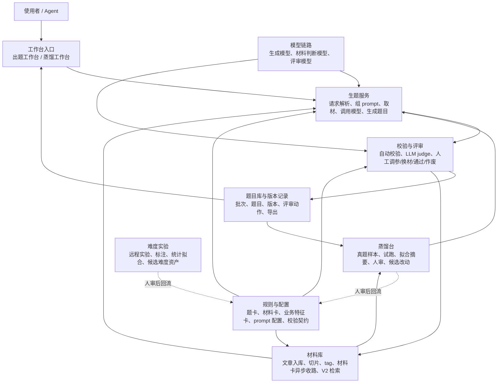

# 简版总架构图源稿

```mermaid
flowchart TB
  User["使用者 / Agent"] --> UI["工作台入口\n出题工作台 / 蒸馏工作台"]

  UI --> Gen["生题服务\n请求解析、组 prompt、取材、调用模型、生成题目"]
  Gen --> Review["校验与评审\n自动校验、LLM judge、人工调参/换材/通过/作废"]
  Review --> Store["题目库与版本记录\n批次、题目、版本、评审动作、导出"]
  Store --> UI

  Material["材料库\n文章入库、切片、tag、材料卡异步收路、V2 检索"] --> Gen
  Review --> Material

  Rules["规则与配置\n题卡、材料卡、业务特征卡、prompt 配置、校验契约"] --> Gen
  Rules --> Material
  Rules --> Review

  Distill["蒸馏台\n真题样本、试跑、拟合摘要、人审、候选改动"] --> Gen
  Distill -. 人审后回流 .-> Rules

  Difficulty["难度实验\n远程实验、标注、统计拟合、候选难度资产"] -. 人审后回流 .-> Rules

  Model["模型链路\n生成模型、材料判断模型、评审模型"] --> Gen
  Model --> Review

  Store --> Distill
  Material --> Distill
```
