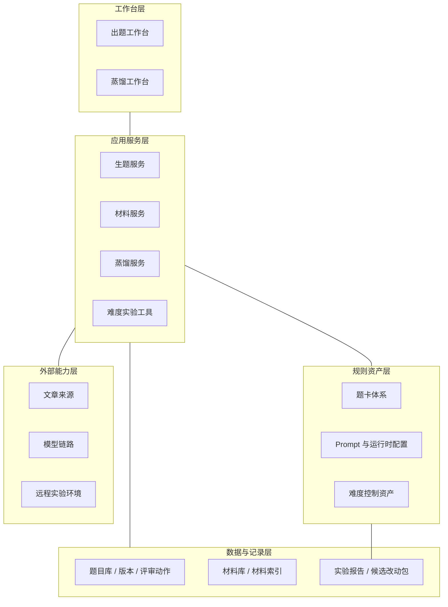

# 简洁总架构图源稿

> 这张是架构图，不是流程图。只表达系统分层、模块归属和主要依赖。

```mermaid
flowchart TB
  subgraph UI["工作台层"]
    Demo["出题工作台"]
    DistillUI["蒸馏工作台"]
  end

  subgraph Service["应用服务层"]
    Question["生题服务"]
    Material["材料服务"]
    Distill["蒸馏服务"]
    Difficulty["难度实验工具"]
  end

  subgraph Rules["规则资产层"]
    Cards["题卡体系"]
    Prompt["Prompt 与运行时配置"]
    DifficultyAssets["难度控制资产"]
  end

  subgraph Data["数据与记录层"]
    QuestionDB["题目库 / 版本 / 评审动作"]
    MaterialDB["材料库 / 材料索引"]
    Reports["实验报告 / 候选改动包"]
  end

  subgraph External["外部能力层"]
    Sources["文章来源"]
    Models["模型链路"]
    Remote["远程实验环境"]
  end

  UI --- Service
  Service --- Rules
  Service --- Data
  Service --- External
  Rules --- Reports
```
