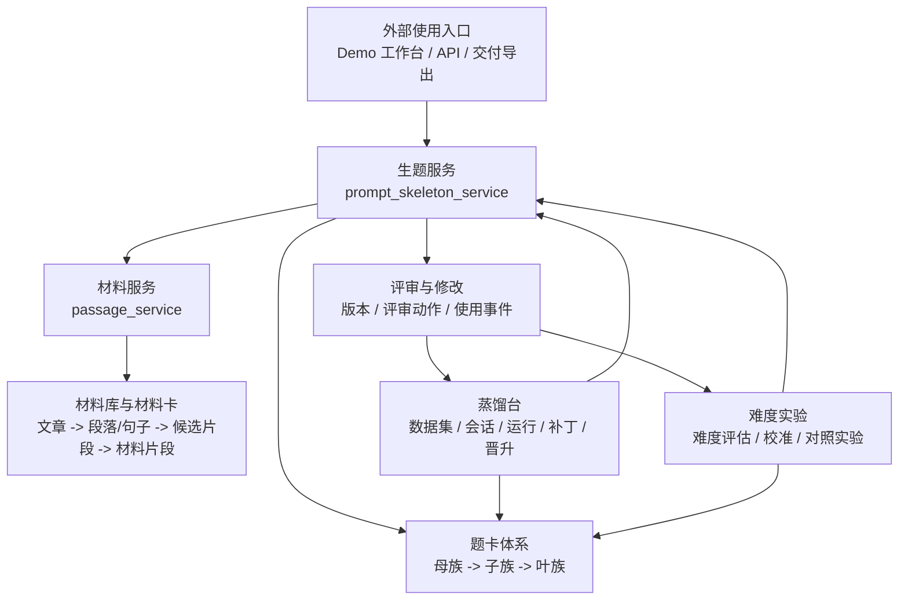

# 项目总览（project_portfolio_overview）

这是一套面向语文阅读理解题目生产的“材料-生题-评审-蒸馏-难度实验”闭环系统。项目的核心目标不是单次调用大模型生成一道题，而是把题型体系、材料供给、生成协议、人工/自动评审、蒸馏修补和难度校准都沉淀成可追踪、可复用、可迭代的工程资产。

## 一句话介绍

项目把阅读理解题目的生产过程拆成两类服务和多套资产：材料服务负责收集、清洗、切分、打标和材料卡收路；生题服务负责按题卡体系生成、评审、修改、交付题目；蒸馏台和难度实验把真实样例、失败样例、评审结果继续回流到卡片、提示词和难度控制策略中。

## 适合展示的项目定位

- **业务定位**：阅读理解题目生产与质量迭代平台。
- **工程定位**：双 FastAPI 服务 + SQLite/配置资产 + 单页工作台 + 批处理/异步任务 + 可观测诊断。
- **能力定位**：把“题型理解、材料匹配、生成协议、评审修补、难度控制”从经验性工作转成结构化系统。
- **交接定位**：新同学可以从总架构图进入，再分别阅读题卡体系、材料库、蒸馏台、难度实验和本地启动文档。

## 总体结构



这里的主线可以理解为：

1. **材料进入系统**：文章被抓取或导入，经过清洗、切分、打标、索引，形成可被题型消费的材料片段。
2. **题卡驱动生成**：生题服务按照“母族 -> 子族 -> 叶族”的题卡体系选择协议、材料和生成约束。
3. **结果进入评审**：题目不是一次性产物，会保存批次、题目、版本、评审动作和使用事件。
4. **蒸馏和实验回流**：失败样例、真实样例、评审结果进入蒸馏台和难度实验，反向修补题卡、提示词、材料适配和难度策略。

## 核心服务

### 生题服务（prompt_skeleton_service）

生题服务是题目生产和工作台入口，主要职责包括：

- 按题卡体系组织题型、业务子类和叶族协议。
- 连接材料服务，拿到适合当前题型和难度目标的材料。
- 构造提示词、调用模型、解析结构化结果、执行校验。
- 保存生成批次、题目版本、评审动作和使用事件。
- 提供 Demo 工作台、蒸馏工作台、诊断、指标和管理接口。

### 材料服务（passage_service）

材料服务是材料供给和材料卡收路入口，主要职责包括：

- 接收或抓取文章，保存原文和清洗文本。
- 将文章切分成段落、句子和候选片段。
- 对候选材料做题型适配、质量标记、标签和索引。
- 保存人工审阅、反馈记录、反馈聚合和审计事件。
- 对外提供材料检索、V2 预计算和材料诊断能力。

### 蒸馏台

蒸馏台不是独立的孤岛，而是“生成结果 -> 评审证据 -> 补丁候选 -> 晋升资产”的回流环节。它把样例集、运行记录、评审结论和补丁保存下来，最后影响题卡、提示词、运行协议或材料适配规则。

### 难度实验

难度实验用于验证题目难度控制是否真实有效。它关心同一题型、同一材料或同一控制变量下，题目是否符合目标难度，并把失败案例回流到题卡叶族、难度词、材料筛选和评估规则中。

## 题卡体系的项目语言

项目里最重要的业务表达是：

```text
母族 -> 子族 -> 叶族
```

- **母族**：题型大类，例如中心理解、句子填空、句子排序、续写、标题选择。
- **子族**：同一母族下的业务场景或能力方向。
- **叶族**：真正落到生成协议、约束、材料需求和难度控制的最小消费单元。

题卡、材料卡、信号层、功能槽位、运行映射都可以看作承载资产；它们服务于母族、子族、叶族这条业务结构。

## 当前项目亮点

- **闭环明显**：不是单纯生题，而是材料、生成、评审、蒸馏、实验持续回流。
- **业务结构清晰**：母族、子族、叶族能解释题型体系，适合在面试中讲“领域建模”。
- **工程边界明确**：材料服务和生题服务职责分开，接口与数据表都有沉淀。
- **证据链完整**：批次、版本、评审动作、使用事件、蒸馏运行和晋升记录都能追踪。
- **可本地演示**：提供启动脚本、环境 profile、工作台页面和 smoke/load 测试脚本。

## 推荐阅读顺序

1. 项目交接索引（project_handoff_index）
2. 总架构图（layered_overall_architecture）
3. 题卡消费路径架构图（card_family_consumption_architecture）
4. 核心功能清单（core_feature_catalog）
5. 本地启动与测试（local_startup_and_testing）
6. 数据与表结构图（data_schema_overview）
