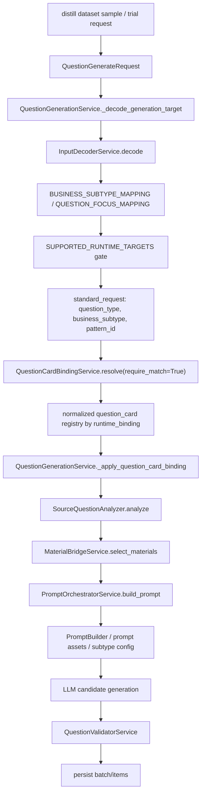

# word_usage_content_word Proto Mapping Audit

Date: 2026-04-25

## Scope

This audit investigates why the real distill trial for the new leaf pack `实词.docx`
failed at:

```text
Selected business_subtype is not mapped yet.
business_subtype = word_usage_content_word
```

The goal is not to promote `word_usage` into a formal stable mother family. The
goal is to identify the minimum safe route from "new leaf evidence exists" to
"experimental/proto generation trial can run for human review".

## Current Error Source

The error is raised in:

`prompt_skeleton_service/app/services/input_decoder.py`

Relevant points:

- `BUSINESS_SUBTYPE_MAPPING` only maps:
  - `sentence_order_selection -> sentence_order / None`
  - `sentence_fill_selection -> sentence_fill / None`
  - `center_understanding -> main_idea / center_understanding`
  - `title_selection -> main_idea / title_selection`
- `_resolve_mapping()` looks up `request.business_subtype` in that mapping.
- If the subtype is absent, it raises `DomainError("Selected business_subtype is not mapped yet.")`.
- Even after adding a mapping, `_ensure_supported_target()` gates against `SUPPORTED_RUNTIME_TARGETS`.

Current supported runtime targets in `input_decoder.py`:

```text
(main_idea, center_understanding)
(main_idea, title_selection)
(sentence_order, None)
(sentence_fill, None)
```

So `word_usage_content_word` is missing at the first gate and would also be
rejected by the second gate unless `SUPPORTED_RUNTIME_TARGETS` is extended or a
separate proto path is introduced.

## Current Mapping Chain



## Existing Binding Model

### Input decoder

`input_decoder.py` is a hard-coded UI/runtime target decoder. It translates
business subtype or question focus into a `MappingTarget`, then blocks anything
outside current official runtime targets.

### Question card binding

`question_card_binding.py` separately indexes normalized question cards. It has
its own `SUPPORTED_RUNTIME_BINDINGS`:

```text
(main_idea, center_understanding)
(main_idea, title_selection)
(sentence_fill, None)
(sentence_order, None)
```

It ignores normalized cards whose `runtime_binding` is outside this set. During
generation, `QuestionGenerationService._resolve_question_card_binding()` calls
`QuestionCardBindingService.resolve(..., require_match=True)`, so an unmapped or
unregistered runtime binding fails before material or prompt generation.

### Type config / prompt config

`PromptOrchestratorService.build_prompt()` loads a question type config and, if
`business_subtype` is set, requires that subtype to exist inside the type config.

Current configs include:

- `prompt_skeleton_service/configs/types/main_idea.yaml`
- `prompt_skeleton_service/configs/types/sentence_fill.yaml`
- `prompt_skeleton_service/configs/types/sentence_order.yaml`
- `prompt_skeleton_service/configs/types/continuation.yaml`

There is no `word_usage.yaml` type config and no `word_usage_content_word`
business subtype under an existing type.

### Source question analyzer

`SourceQuestionAnalyzer.infer_request_target()` only infers:

- sentence order
- sentence fill
- title selection as center understanding
- center understanding

It does not infer `word_usage`.

### Prompt assets and validator

Prompt assets currently have family-specific guards for:

- `main_idea` / `center_understanding`
- `sentence_fill`
- `sentence_order`

Validator logic is also specialized for the existing formal families. There is
no formal word-usage validator contract.

## What Is Missing For `word_usage_content_word`

The missing pieces are layered:

1. Input decoder mapping:
   `word_usage_content_word` is absent from `BUSINESS_SUBTYPE_MAPPING`.

2. Runtime target allow-list:
   `("word_usage", "word_usage_content_word")` or an equivalent proto runtime key
   is absent from `SUPPORTED_RUNTIME_TARGETS`.

3. Question card binding:
   no normalized/proto card is indexed for the runtime binding, and
   `SUPPORTED_RUNTIME_BINDINGS` currently ignores non-official runtime bindings.

4. Type config:
   no `word_usage` type config exists, so prompt slot resolution cannot run as a
   normal family.

5. Material strategy:
   material bridge has no explicit `word_usage` material strategy.

6. Prompt profile:
   no `proto_word_usage_explanation` prompt profile exists.

7. Validator contract:
   no formal word-usage validator exists. A proto route must stay at minimal JSON
   shape validation only.

## Does The Distill Trial Request Carry Enough Fields?

Yes, for a proto trial it carries enough seed information:

- `question_focus = word_usage`
- `business_subtype = word_usage_content_word`
- `difficulty_level`
- `source_question`
- optional `topic`
- optional `type_slots` / `extra_constraints`

The missing layer is not request data. It is runtime mapping and generation
support.

## Existing Fallback / Proto Mechanisms

There are partial mechanisms, but no complete proto route:

- `QuestionCardBindingService.resolve(..., require_match=False)` can return an
  unresolved binding, but generation currently calls it with `require_match=True`.
- Distill workbench can run with a mock/fixture generator in tests, but the real
  service requires official runtime support.
- Forced user material mode can bypass material retrieval, but not the input
  decoder and question card binding gates.
- `leaf_pre_distill` can produce `bootstrap_discovery.json`, but that artifact is
  intentionally evidence-only and is not a runtime schema.

## Option Comparison

### Option A: Demo/Test Runner Mock Only

Description:
Use a fixture generator in tests or local scripts to make distill review/patch/
promotion pass without touching the generation service.

Pros:

- Lowest implementation risk.
- Does not affect formal generation.
- Good for validating review / patch / promotion evidence flow.

Cons:

- Not user-self-service in the real system.
- Does not exercise real `/api/v1/distill/sessions/{id}/trials` generation.
- The actual blocker remains.

Why it is not enough:
The user needs a system path that a normal workbench user can run, not an
operator-only script or monkeypatch.

### Option B: Experimental/Proto Business Subtype Mapping

Description:
Add a narrow proto route for `word_usage_content_word`, explicitly marked
experimental and blocked from formal promotion/writeback.

Recommended proto identity:

```yaml
business_subtype: word_usage_content_word
mother_family_id: word_usage
child_family_id: word_usage_content_word
question_card_id: proto.word_usage.content_word.v0
business_feature_card_id: proto.word_usage.content_word.feature.v0
material_strategy: proto_text_context_window
validator_contract: proto_minimal_json_shape_only
prompt_profile: proto_word_usage_explanation
experimental: true
proto_family: word_usage
proto_child_family: word_usage_content_word
source: bootstrap_discovery
formalized: false
```

Pros:

- Lets real distill trial pass the unmapped gate.
- Keeps the new route visibly experimental.
- Can generate reviewable proto items without pretending the family is stable.
- Provides a natural next step after `bootstrap_discovery.json`.

Cons:

- Touches the generation path.
- Needs a carefully isolated proto guard to avoid unrestricted subtype fallback.
- Requires minimal prompt/type/binding support or a special proto generation
  branch.
- Needs tests to ensure existing families are unchanged.

Impact range:

- `input_decoder.py`
- `question_card_binding.py` or a separate proto binding layer
- possibly `question_generation.py`
- possibly `configs/types/word_usage_proto.yaml` or a small in-code proto prompt
  branch
- tests under `prompt_skeleton_service/tests/`

Recommendation:
Recommended, but only as a narrow follow-up patch with tests. It is not a
one-line mapping addition.

### Option C: Formal `word_usage` Mother Family / Full Cards

Description:
Create full normalized question cards, material cards, signal layers, runtime
mappings, prompt assets, and validator contract for `word_usage`.

Pros:

- Long-term clean architecture.
- Avoids special proto branches.
- Gives production-quality structure once enough evidence has accumulated.

Cons:

- Too much schema commitment too early.
- Would prematurely convert `candidate_axes` into formal fields.
- High risk of locking in weak axes from a single leaf pack.
- Requires validator and material strategy design, not just mapping.

Why not now:
The current evidence says `field_candidates` is still empty and discovery output
is hypothesis-only. Formalization should happen after axis confirmation and at
least one confirmation pass.

## Recommended Plan

Use Option B as the next implementation slice, but keep this audit-only patch
separate from the implementation.

### Minimum implementation shape

1. Add an explicit proto registry entry rather than a broad fallback:

```python
PROTO_BUSINESS_SUBTYPE_MAPPING = {
    "word_usage_content_word": {
        "question_type": "word_usage",
        "business_subtype": "word_usage_content_word",
        "experimental": True,
        "proto_family": "word_usage",
        "proto_child_family": "word_usage_content_word",
        "source": "bootstrap_discovery",
        "formalized": False,
    }
}
```

2. Add a proto-only generation branch before normalized card binding requires a
   formal question card.

3. The proto branch should only accept:

```text
question_focus = word_usage
business_subtype = word_usage_content_word
extra_constraints.experimental_proto_route = true
```

4. The proto branch should produce a minimal `QuestionGenerationBatchResponse`
   shape with item metadata:

```json
{
  "metadata": {
    "experimental": true,
    "proto_family": "word_usage",
    "proto_child_family": "word_usage_content_word",
    "source": "bootstrap_discovery",
    "formalized": false
  }
}
```

5. The generated proto question shape should be intentionally small:

```text
passage
question/stem
options
answer
analysis/explanation
metadata.experimental = true
metadata.business_subtype = word_usage_content_word
```

6. Validation should be `proto_minimal_json_shape_only` only. It must not modify
   the main validator's formal business rules.

### Why a proto branch is safer than adding a normalized card now

Adding a normalized card under `card_specs/normalized/question_cards` would make
the route look formally closed, which conflicts with the current evidence state.
The proto branch can stay trial-only and can explicitly require the experimental
flag.

## Expected File Changes For The Follow-Up Patch

Likely required:

- `prompt_skeleton_service/app/services/input_decoder.py`
- `prompt_skeleton_service/app/services/question_generation.py`
- `prompt_skeleton_service/tests/test_word_usage_proto_mapping.py`
- `docs/word_usage_content_word_proto_mapping_execution_report_2026-04-25.md`

Possible but should be avoided unless necessary:

- `prompt_skeleton_service/app/services/question_card_binding.py`
- `prompt_skeleton_service/configs/types/word_usage_proto.yaml`
- `prompt_skeleton_service/configs/question_generation_prompt_assets.yaml`

Should not be changed in the proto slice:

- `card_specs/normalized/*`
- database schema / migrations
- distill promotion target list
- `card_specs` formal runtime mappings
- formal validator business rules
- frontend tab/UI beyond optional display labels

## Risk Controls

- No wildcard fallback for unknown subtypes.
- Require both known proto subtype and explicit proto flag.
- Mark every generated item as experimental/proto.
- Do not add `word_usage` to formal normalized card registry.
- Do not write `bootstrap_discovery.candidate_axes` into `field_candidates`.
- Do not write anything back into `card_specs`.
- Keep `leaf_pre_distill_report`, `llm_field_probe`, and
  `bootstrap_discovery` as evidence attachments only.
- Run existing three-family tests after implementation.

## Rollback

If the proto route causes instability, rollback is straightforward:

1. Remove the single proto mapping entry.
2. Remove or disable the proto generation branch.
3. Remove the proto tests.
4. Existing normalized cards and database schema remain untouched.

Because the recommended implementation should not change formal configs or DB
schema, rollback should not require migration.

## Acceptance Commands

If only this audit document is added:

```powershell
git diff -- docs/word_usage_content_word_proto_mapping_audit_2026-04-25.md
```

If the follow-up proto implementation is added:

```powershell
$env:PYTHONPATH='E:\agent_repo_src\prompt_skeleton_service'; python -m unittest prompt_skeleton_service.tests.test_word_usage_proto_mapping
$env:PYTHONPATH='E:\agent_repo_src\prompt_skeleton_service'; python -m unittest prompt_skeleton_service.tests.test_distill_workbench
python -m unittest discover -s tests -p test_leaf_pre_distill.py
```

## Audit Decision

This audit does not implement proto generation mapping.

Reason:
The failure is not a single missing dictionary entry. A safe proto route needs a
small but explicit generation branch or proto registry so it can pass the real
system while staying outside formal normalized cards and validator logic.

Recommended next patch:
Implement Option B as a narrow experimental/proto route for
`word_usage_content_word`, guarded by an explicit proto flag and covered by
targeted tests.

